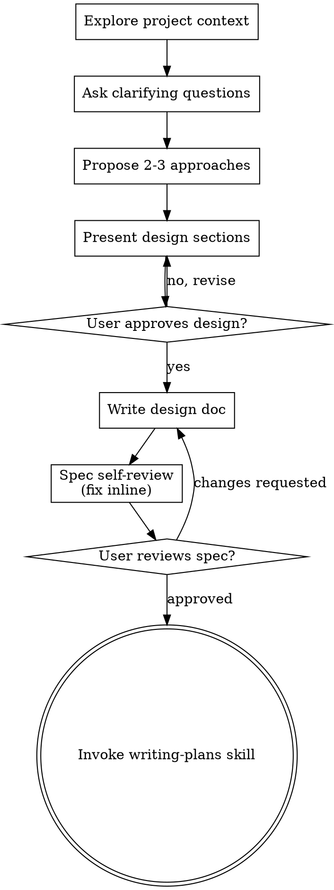
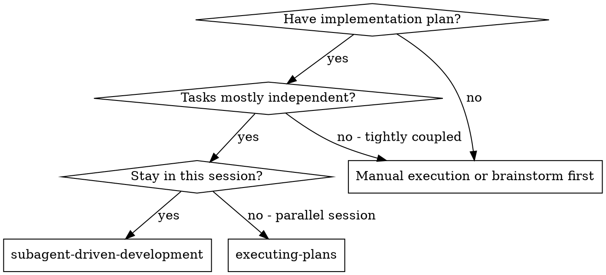
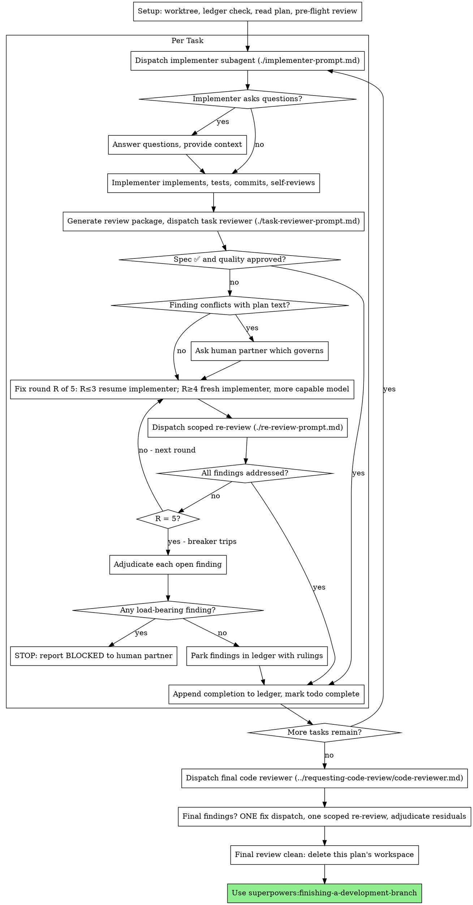

# Nextavea Service - redesign session

Readable export of the Claude Code session. Internal reasoning and
bulk tool output are omitted; tool calls appear as one-line notes.
The complete raw logs are in `raw/`.

---

## User

so regarding for the website, do not change the structure and content texts, only improve the design 

make sure to always user supoerpower plugin, frontend design plugin if neccessary

### Claude

I'll start with the brainstorming skill as the process skill here, then move to implementation.

> _(ran: Skill)_

## User

Base directory for this skill: C:\Users\leont\.claude\plugins\cache\superpowers-dev\superpowers\6.2.0\skills\brainstorming

# Brainstorming Ideas Into Designs

Help turn ideas into fully formed designs and specs through natural collaborative dialogue.

Start by understanding the current project context, then ask questions one at a time to refine the idea. Once you understand what you're building, present the design and get user approval.

<HARD-GATE>
Do NOT invoke any implementation skill, write any code, scaffold any project, or take any implementation action until you have presented a design and the user has approved it. This applies to EVERY project regardless of perceived simplicity.
</HARD-GATE>

## Anti-Pattern: "This Is Too Simple To Need A Design"

Every project goes through this process. A todo list, a single-function utility, a config change — all of them. "Simple" projects are where unexamined assumptions cause the most wasted work. The design can be short (a few sentences for truly simple projects), but you MUST present it and get approval.

## Checklist

You MUST create a task for each of these items and complete them in order:

1. **Explore project context** — check files, docs, recent commits
2. **Offer the visual companion just-in-time** — NOT upfront. The first time a question would genuinely be clearer shown than described, offer it then (its own message); on approval its browser tab opens for you. If no visual question ever arises, never offer it. See the Visual Companion section below.
3. **Ask clarifying questions** — one at a time, understand purpose/constraints/success criteria
4. **Propose 2-3 approaches** — with trade-offs and your recommendation
5. **Present design** — in sections scaled to their complexity, get user approval after each section
6. **Write design doc** — save to `docs/superpowers/specs/YYYY-MM-DD-<topic>-design.md` and commit
7. **Spec self-review** — quick inline check for placeholders, contradictions, ambiguity, scope (see below)
8. **User reviews written spec** — ask user to review the spec file before proceeding
9. **Transition to implementation** — invoke writing-plans skill to create implementation plan

## Process Flow



**The terminal state is invoking writing-plans.** Do NOT invoke frontend-design, mcp-builder, or any other implementation skill. The ONLY skill you invoke after brainstorming is writing-plans.

## The Process

**Understanding the idea:**

- Check out the current project state first (files, docs, recent commits)
- Before asking detailed questions, assess scope: if the request describes multiple independent subsystems (e.g., "build a platform with chat, file storage, billing, and analytics"), flag this immediately. Don't spend questions refining details of a project that needs to be decomposed first.
- If the project is too large for a single spec, help the user decompose into sub-projects: what are the independent pieces, how do they relate, what order should they be built? Then brainstorm the first sub-project through the normal design flow. Each sub-project gets its own spec → plan → implementation cycle.
- For appropriately-scoped projects, ask questions one at a time to refine the idea
- Prefer multiple choice questions when possible, but open-ended is fine too
- Only one question per message - if a topic needs more exploration, break it into multiple questions
- Focus on understanding: purpose, constraints, success criteria

**Exploring approaches:**

- Propose 2-3 different approaches with trade-offs
- Present options conversationally with your recommendation and reasoning
- Lead with your recommended option and explain why
- YAGNI ruthlessly - remove unnecessary features from every approach and design

**Presenting the design:**

- Once you believe you understand what you're building, present the design
- Scale each section to its complexity: a few sentences if straightforward, up to 200-300 words if nuanced
- Ask after each section whether it looks right so far
- Cover: architecture, components, data flow, error handling, testing
- Be ready to go back and clarify if something doesn't make sense

**Design for isolation and clarity:**

- Break the system into smaller units that each have one clear purpose, communicate through well-defined interfaces, and can be understood and tested independently
- For each unit, you should be able to answer: what does it do, how do you use it, and what does it depend on?
- Can someone understand what a unit does without reading its internals? Can you change the internals without breaking consumers? If not, the boundaries need work.
- Smaller, well-bounded units are also easier for you to work with - you reason better about code you can hold in context at once, and your edits are more reliable when files are focused. When a file grows large, that's often a signal that it's doing too much.

**Working in existing codebases:**

- Explore the current structure before proposing changes. Follow existing patterns.
- Where existing code has problems that affect the work (e.g., a file that's grown too large, unclear boundaries, tangled responsibilities), include targeted improvements as part of the design - the way a good developer improves code they're working in.
- Don't propose unrelated refactoring. Stay focused on what serves the current goal.

## After the Design

**Documentation:**

- Write the validated design (spec) to `docs/superpowers/specs/YYYY-MM-DD-<topic>-design.md`
  - (User preferences for spec location override this default)
- Use elements-of-style:writing-clearly-and-concisely skill if available
- Commit the design document to git

**Spec Self-Review:**
After writing the spec document, look at it with fresh eyes:

1. **Placeholder scan:** Any "TBD", "TODO", incomplete sections, or vague requirements? Fix them.
2. **Internal consistency:** Do any sections contradict each other? Does the architecture match the feature descriptions?
3. **Scope check:** Is this focused enough for a single implementation plan, or does it need decomposition?
4. **Ambiguity check:** Could any requirement be interpreted two different ways? If so, pick one and make it explicit.

Fix any issues inline. No need to re-review — just fix and move on.

**User Review Gate:**
After the spec review loop passes, ask the user to review the written spec before proceeding:

> "Spec written and committed to `<path>`. Please review it and let me know if you want to make any changes before we start writing out the implementation plan."

Wait for the user's response. If they request changes, make them and re-run the spec review loop. Only proceed once the user approves.

**Implementation:**

- Invoke the writing-plans skill to create a detailed implementation plan
- Do NOT invoke any other skill. writing-plans is the next step.

## Visual Companion

A browser-based companion for showing mockups, diagrams, and visual options during brainstorming. Available as a tool — not a mode. Accepting the companion means it's available for questions that benefit from visual treatment; it does NOT mean every question goes through the browser.

**Offering the companion (just-in-time):** Do NOT offer it upfront. Wait until a question would genuinely be clearer shown than told — a real mockup / layout / diagram question, not merely a UI *topic*. The first time that happens, offer it then, as its own message:
> "This next part might be easier if I show you — I can put together mockups, diagrams, and comparisons in a browser tab as we go. It's still new and can be token-intensive. Want me to? I'll open it for you."

**This offer MUST be its own message.** Only the offer — no clarifying question, summary, or other content. Wait for the user's response. If they accept, start the server with `--open` so their browser opens to the first screen automatically. If they decline, continue text-only and don't offer again unless they raise it.

**Per-question decision:** Even after the user accepts, decide FOR EACH QUESTION whether to use the browser or the terminal. The test: **would the user understand this better by seeing it than reading it?**

- **Use the browser** for content that IS visual — mockups, wireframes, layout comparisons, architecture diagrams, side-by-side visual designs
- **Use the terminal** for content that is text — requirements questions, conceptual choices, tradeoff lists, A/B/C/D text options, scope decisions

A question about a UI topic is not automatically a visual question. "What does personality mean in this context?" is a conceptual question — use the terminal. "Which wizard layout works better?" is a visual question — use the browser.

If they agree to the companion, read the detailed guide before proceeding:
`skills/brainstorming/visual-companion.md`


ARGUMENTS: Improve the visual design of the CleaningSystem website without changing structure or content text

> _(ran: Bashx8)_

### Claude

I've read the whole codebase. Here's what I found before I propose anything.

**Current design state** ([css/components.css](css/components.css), 700 lines, the only stylesheet actually loaded):
- Generic sky-blue (`#0284c7`) + glassmorphism look; system font stack (Inter is declared in [css/style.css](css/style.css) but that file is **never linked** — dead code)
- A random Unsplash photo as a fixed body background fighting every card for attention
- No design tokens — ~40 hardcoded hex values, spacing in arbitrary px
- Duplicate/conflicting rules: `.feature-badge`, `.features-grid`, `.portfolio-grid`, `.portfolio-card` are each defined **twice**, second one overriding with `!important`
- Inline styles scattered through JS ([header.js:70-79](js/components/header.js#L70-L79), [portfolio.js](js/pages/portfolio.js), [about.js](js/pages/about.js), [contacts.js](js/pages/contacts.js))
- Mobile nav wraps to two rows, "fixed" by `padding-top: 145px` — no hamburger
- Card hover states are all `translateY(-5px)` + shadow, no hierarchy

**Two real bugs I noticed** (not design, but they affect what you'd see):
1. [header.js:87-91](js/components/header.js#L87-L91) — nav links are `#services`, `#portfolio`… but [router.js:9-16](js/router.js#L9-L16) registers `/services`, `/portfolio`. Every nav link silently falls back to the home page.
2. [index.html:15-22](index.html#L15-L22) declares `header/main#main-content/footer`, then [app.js:8-18](js/app.js#L8-L18) appends a **second** set. Duplicate IDs; pages render into the empty first `<main>`, above the real header.

Also: `frontend/` is a stale duplicate of the root (older `portfolio.js`, shorter CSS).

> _(ran: AskUserQuestion)_

### Claude

Good. Locking in: **warm premium brand**, **CSS + de-inline the JS**, **both bugs fixed**. I'll leave `frontend/` in place and untouched (you didn't say delete, and it's non-destructive to just ignore it) — say the word if you want it gone.

Here's the design.

---

## 1. Foundations — design tokens

Everything gets driven off a `:root` token block at the top of `components.css`. No more loose hex values.

**Palette** — teal-ink as the *structural* color, brass/amber as the *action* color. That pairing is what makes it read "premium service" rather than "SaaS dashboard."

| Token | Value | Use |
|---|---|---|
| `--ink` | `#0F2A2E` | header, footer, featured price card |
| `--ink-2` | `#0A1F22` | ink hover/depth |
| `--canvas` | `#F7F5F1` | page background (**replaces the Unsplash photo**) |
| `--surface` | `#FFFFFF` | cards, form |
| `--border` | `#E6E0D6` | warm hairline, 1px |
| `--text` | `#1A2E2C` | body |
| `--text-2` | `#5C6B68` | secondary |
| `--accent` | `#B26A20` | buttons, links, focus — 4.6:1 on white |
| `--accent-hover` | `#8F5318` | |
| `--accent-soft` | `#FBF1E3` | pills, tinted tiles |
| `--accent-on-ink` | `#E0A458` | logo span, links on dark |
| `--price` | `#2F6B4F` | replaces the neon `#10b981` |

**Type** — two families, both with full Cyrillic (you support `ru`):
- **Playfair Display** (700) — `.page-title`, `.hero-section h1`, `.section-title` only
- **Manrope** (400/500/600/800) — everything else

Loaded via `<link rel="preconnect">` + font `<link>` in `index.html`. Fluid scale with `clamp()` so the hero doesn't need the three separate mobile overrides it has now.

**Spacing** 4px-based `--s1`…`--s9`. **Radii** 8/12/18/pill. **Shadows** tinted `rgba(23,36,34,…)` not pure black — pure black shadows on a warm canvas look dirty.

> Flag: if Playfair reads too formal for a cleaning service, it's one token to swap to all-Manrope. Tell me now or after you see it.

## 2. What gets removed

- The fixed-attachment Unsplash body background — it's a 200KB+ render-blocking image fighting every card, and it's the reason everything needed `backdrop-filter` glass to stay readable
- `backdrop-filter` on cards (kept **only** on the header, where it's actually earning its keep over scrolled content)
- All four duplicate rule blocks (`.feature-badge`, `.features-grid`, `.portfolio-grid`, `.portfolio-card`) and their `!important` patches
- Dead [css/style.css](css/style.css) — unlinked, conflicting. I'd delete it; say if you'd rather I leave it.

## 3. Components

**Header** — solid ink, single 68px row. `.btn-nav` becomes solid amber (currently blue-on-navy, low contrast). `#lang-select` loses its 9-line inline style and picks up the `.lang-select` class that already exists in CSS but is never applied. **Mobile:** instead of wrapping to two rows and compensating with `padding-top:145px`, the nav becomes a horizontally scroll-snapped strip — one row at every width, no new DOM, so it stays inside your "no structure change" rule.

**Hero** — larger display type, badge as a hairline amber pill. Stats stop being a floating glass slab and become a bordered strip with vertical dividers.

**Feature / service / portfolio cards** — one shared card language: solid white, 1px warm border, r18. Hover: border→amber, shadow lift, image `scale(1.04)`, `.feature-link` arrow slides right. Service card emoji gets a 44px tinted rounded tile instead of floating bare.

**Prices** — `.featured` inverts to an ink background instead of just a blue border, so "popular" actually reads at a glance. `<li>` rows get a small amber bullet via `::before`.

**Contacts** — 44px inputs, and a real focus ring (`0 0 0 3px` amber wash) — right now focus only nudges the border color, which is close to invisible.

**Portfolio modal** — proper dimmed+blurred backdrop, r20 panel, circular ink close button, and the comparison handle becomes an amber circle instead of a white pill.

## 4. Accessibility & motion

- `:focus-visible` rings on every interactive element — there are currently **none**
- Full `@media (prefers-reduced-motion: reduce)` block killing transforms/transitions
- All pairs contrast-checked at AA

## 5. Bug fixes (as approved)

- [header.js:87-91](js/components/header.js#L87-L91) — `#services` → `#/services` on all five links, so nav stops silently falling back to home
- [index.html:15-22](index.html#L15-L22) — drop the three empty placeholder elements; [app.js](js/app.js) already creates the real ones

## 6. Files touched

`index.html` · `css/components.css` (rewrite) · `css/style.css` (delete) · `js/components/header.js` · `js/pages/portfolio.js` · `js/pages/about.js` · `js/pages/contacts.js` — the JS edits are **style-attribute removal + class-attribute addition only**. Zero text, zero elements, zero logic.

## 7. Verification

No test framework here. I'll serve locally and walk all six routes at 1440 / 768 / 375, plus grep every class name used in JS against the new stylesheet to confirm nothing lost a rule.

---

**Note:** this isn't a git repo, so I can't commit the spec as the skill normally would. Want me to `git init` first, or just write the spec file?

Does this design look right? Once you approve I'll write it to `docs/superpowers/specs/2026-08-28-cleaning-site-redesign-design.md` and move to the implementation plan.

## User

yes, and move on with .md files as always forgot to tell you

### Claude

Approved. Writing the spec now.

> _(ran: Bash)_

### Claude

Heredoc got mangled by the shell wrapper — switching to the Write tool for this file.

> _(ran: Write)_

### Claude

Spec written and self-reviewed (no placeholders, no contradictions, scope is single-plan sized): [2026-08-28-cleaning-site-redesign-design.md](docs/superpowers/specs/2026-08-28-cleaning-site-redesign-design.md)

Taking your "move on" as clearing the review gate. Proceeding to the implementation plan.

> _(ran: Skill)_

## User

Base directory for this skill: C:\Users\leont\.claude\plugins\cache\superpowers-dev\superpowers\6.2.0\skills\writing-plans

# Writing Plans

## Overview

Write comprehensive implementation plans assuming the engineer has zero context for our codebase and questionable taste. Document everything they need to know: which files to touch for each task, code, testing, docs they might need to check, how to test it. Give them the whole plan as bite-sized tasks. DRY. YAGNI. TDD. Frequent commits.

Assume they are a skilled developer, but know almost nothing about our toolset or problem domain. Assume they don't know good test design very well.

**Announce at start:** "I'm using the writing-plans skill to create the implementation plan."

**Context:** If working in an isolated worktree, it should have been created via the `superpowers:using-git-worktrees` skill at execution time.

**Save plans to:** `docs/superpowers/plans/YYYY-MM-DD-<feature-name>.md`
- (User preferences for plan location override this default)

## Scope Check

If the spec covers multiple independent subsystems, it should have been broken into sub-project specs during brainstorming. If it wasn't, suggest breaking this into separate plans — one per subsystem. Each plan should produce working, testable software on its own.

## File Structure

Before defining tasks, map out which files will be created or modified and what each one is responsible for. This is where decomposition decisions get locked in.

- Design units with clear boundaries and well-defined interfaces. Each file should have one clear responsibility.
- You reason best about code you can hold in context at once, and your edits are more reliable when files are focused. Prefer smaller, focused files over large ones that do too much.
- Files that change together should live together. Split by responsibility, not by technical layer.
- In existing codebases, follow established patterns. If the codebase uses large files, don't unilaterally restructure - but if a file you're modifying has grown unwieldy, including a split in the plan is reasonable.

This structure informs the task decomposition. Each task should produce self-contained changes that make sense independently.

## Task Right-Sizing

A task is the smallest unit that carries its own test cycle and is worth a
fresh reviewer's gate. When drawing task boundaries: fold setup,
configuration, scaffolding, and documentation steps into the task whose
deliverable needs them; split only where a reviewer could meaningfully
reject one task while approving its neighbor. Each task ends with an
independently testable deliverable.

## Bite-Sized Task Granularity

**Each step is one action (2-5 minutes):**
- "Write the failing test" - step
- "Run it to make sure it fails" - step
- "Implement the minimal code to make the test pass" - step
- "Run the tests and make sure they pass" - step
- "Commit" - step

## Plan Document Header

**Every plan MUST start with this header:**

```markdown
# [Feature Name] Implementation Plan

> **For agentic workers:** REQUIRED SUB-SKILL: Use superpowers:subagent-driven-development (recommended) or superpowers:executing-plans to implement this plan task-by-task. Steps use checkbox (`- [ ]`) syntax for tracking.

**Goal:** [One sentence describing what this builds]

**Architecture:** [2-3 sentences about approach]

**Tech Stack:** [Key technologies/libraries]

## Global Constraints

[The spec's project-wide requirements — version floors, dependency limits,
naming and copy rules, platform requirements — one line each, with exact
values copied verbatim from the spec. Every task's requirements implicitly
include this section.]

---
```

## Task Structure

````markdown
### Task N: [Component Name]

**Files:**
- Create: `exact/path/to/file.py`
- Modify: `exact/path/to/existing.py:123-145`
- Test: `tests/exact/path/to/test.py`

**Interfaces:**
- Consumes: [what this task uses from earlier tasks — exact signatures]
- Produces: [what later tasks rely on — exact function names, parameter
  and return types. A task's implementer sees only their own task; this
  block is how they learn the names and types neighboring tasks use.]

- [ ] **Step 1: Write the failing test**

```python
def test_specific_behavior():
    result = function(input)
    assert result == expected
```

- [ ] **Step 2: Run test to verify it fails**

Run: `pytest tests/path/test.py::test_name -v`
Expected: FAIL with "function not defined"

- [ ] **Step 3: Write minimal implementation**

```python
def function(input):
    return expected
```

- [ ] **Step 4: Run test to verify it passes**

Run: `pytest tests/path/test.py::test_name -v`
Expected: PASS

- [ ] **Step 5: Commit**

```bash
git add tests/path/test.py src/path/file.py
git commit -m "feat: add specific feature"
```
````

## No Placeholders

Every step must contain the actual content an engineer needs. These are **plan failures** — never write them:
- "TBD", "TODO", "implement later", "fill in details"
- "Add appropriate error handling" / "add validation" / "handle edge cases"
- "Write tests for the above" (without actual test code)
- "Similar to Task N" (repeat the code — the engineer may be reading tasks out of order)
- Steps that describe what to do without showing how (code blocks required for code steps)
- References to types, functions, or methods not defined in any task

## Self-Review

After writing the complete plan, look at the spec with fresh eyes and check the plan against it. This is a checklist you run yourself — not a subagent dispatch.

**1. Spec coverage:** Skim each section/requirement in the spec. Can you point to a task that implements it? List any gaps.

**2. Placeholder scan:** Search your plan for red flags — any of the patterns from the "No Placeholders" section above. Fix them.

**3. Type consistency:** Do the types, method signatures, and property names you used in later tasks match what you defined in earlier tasks? A function called `clearLayers()` in Task 3 but `clearFullLayers()` in Task 7 is a bug.

If you find issues, fix them inline. No need to re-review — just fix and move on. If you find a spec requirement with no task, add the task.

## Execution Handoff

After saving the plan, offer execution choice:

**"Plan complete and saved to `docs/superpowers/plans/<filename>.md`. Two execution options:**

**1. Subagent-Driven (recommended)** - I dispatch a fresh subagent per task, review between tasks, fast iteration

**2. Inline Execution** - Execute tasks in this session using executing-plans, batch execution with checkpoints

**Which approach?"**

**If Subagent-Driven chosen:**
- **REQUIRED SUB-SKILL:** Use superpowers:subagent-driven-development
- Fresh subagent per task + two-stage review

**If Inline Execution chosen:**
- **REQUIRED SUB-SKILL:** Use superpowers:executing-plans
- Batch execution with checkpoints for review


ARGUMENTS: Create implementation plan from docs/superpowers/specs/2026-08-28-cleaning-site-redesign-design.md — visual redesign of the BusinessServices cleaning site (warm premium brand direction, CSS rewrite + de-inline JS styles + 2 bug fixes)

### Claude

I'm using the writing-plans skill to create the implementation plan. First, let me pull the exact inline-style blocks I'll be stripping.

> _(ran: Bash)_

### Claude

Now writing the plan.

> _(ran: Write)_

### Claude

Plan complete and saved to [docs/superpowers/plans/2026-08-28-cleaning-site-redesign.md](docs/superpowers/plans/2026-08-28-cleaning-site-redesign.md).

**9 tasks**, ordered so each one is independently verifiable:

| # | Task | Why here |
|---|---|---|
| 1 | Bug fixes + font loading | Nav must work before anything else is testable |
| 2 | Strip inline styles from JS | Inline styles would silently defeat tasks 3–8 |
| 3 | Tokens + reset + layout, delete `style.css` | |
| 4 | Header / nav / footer | |
| 5 | Buttons + hero | |
| 6 | Feature cards, service cards, tabs, badges | |
| 7 | Portfolio, prices, about | |
| 8 | Contacts, focus states, motion, responsive | |
| 9 | Verification script + 18-view walkthrough | |

Every CSS step contains the literal, complete CSS — no "add appropriate styles" placeholders. Three things I want to flag from writing it:

- **Commit steps are omitted** — this isn't a git repo, so each task ends in a verification step instead. If you want checkpoints you can roll back, say so and I'll `git init` first. I'd recommend it before a rewrite this size.
- **Three inline styles must survive** Task 2 (`display:none` on the modal, `width:50%` on `.before-img`, `left:50%` on `.slider-handle`) — `updateSlider` writes to them at runtime. They're pinned as a global constraint so nobody "helpfully" cleans them up and breaks the before/after slider.
- **Task 9 Step 3** diffs every locale string before/after to prove no copy moved. That's the check that enforces your actual requirement.

Two execution options:

**1. Subagent-Driven (the skill's recommendation)** — fresh subagent per task, I review between each. Faster iteration, but it spawns agents, and my standing instruction here is not to do that unless you ask. So: only if you say so.

**2. Inline Execution (my recommendation given that)** — I run the tasks in this session with checkpoints for you to review. Slower turn-by-turn but no agent spawning, and you see every change as it lands.

Which approach?

## User

the skill's recommendation, subagent driven

### Claude

Subagent-driven it is — that's an explicit request, so I'll dispatch agents.

> _(ran: Skill)_

## User

Base directory for this skill: C:\Users\leont\.claude\plugins\cache\superpowers-dev\superpowers\6.2.0\skills\subagent-driven-development

# Subagent-Driven Development

Execute plan by dispatching a fresh implementer subagent per task, a task review (spec compliance + code quality) after each, and a broad whole-branch review at the end.

**Why subagents:** You delegate tasks to specialized agents with isolated context. By precisely crafting their instructions and context, you ensure they stay focused and succeed at their task. They should never inherit your session's context or history — you construct exactly what they need. This also preserves your own context for coordination work.

**Core principle:** Fresh subagent per task + task review (spec + quality) + broad final review = high quality, fast iteration

**Narration:** between tool calls, narrate at most one short line — the
ledger and the tool results carry the record.

**Continuous execution:** Do not pause to check in with your human partner between tasks. Execute all tasks from the plan without stopping. The only reasons to stop are: BLOCKED status you cannot resolve, ambiguity that genuinely prevents progress, or all tasks complete. "Should I continue?" prompts and progress summaries waste their time — they asked you to execute the plan, so execute it.

## When to Use



**vs. Executing Plans (parallel session):**
- Same session (no context switch)
- Fresh subagent per task (no context pollution)
- Review after each task (spec compliance + code quality), broad review at the end
- Faster iteration (no human-in-loop between tasks)

## The Process



## Setup

Ensure the work happens in an isolated workspace: use
superpowers:using-git-worktrees to create one or verify the existing one.
Never start implementation on a main/master branch without your human
partner's explicit consent.

Conversation memory does not survive compaction. In real sessions,
controllers that lost their place have re-dispatched entire completed task
sequences — the single most expensive failure observed. Track progress in
a ledger file, not only in todos.

- Each plan owns a workspace: at skill start, run this skill's
  `scripts/sdd-workspace PLAN_FILE` — it prints the plan's git-ignored
  directory (`<repo-root>/.superpowers/sdd/<plan-basename>/`), home to
  every artifact for THIS plan: ledger, briefs, reports, review packages.
  Another plan's directory is never yours to read or write.
- Check for this plan's ledger at `<workspace>/progress.md`. If its first
  line names your plan file, tasks with a `Task <N>: complete` line are DONE
  — do not re-dispatch them; resume at the first task without one. A task
  whose last line is a fix round is mid-loop: resume the loop at the next
  round. A ledger whose first line names a different plan file — or a stray
  ledger at the old flat path `.superpowers/sdd/progress.md` — is another
  plan's progress: leave it in place and start your own, fresh.
- Create the ledger with its identity as the first line:
  `# SDD ledger — plan: <plan file path>`.
- The ledger is your recovery map: the commits it names exist in git even
  when your context no longer remembers creating them. After compaction,
  trust the ledger and `git log` over your own recollection.
- `git clean -fdx` will destroy the workspace (it's git-ignored scratch); if
  that happens, recover from `git log`.

Read the plan once, note its context and Global Constraints, and create a
todo per task.

Before dispatching Task 1, scan the plan once for conflicts:

- tasks that contradict each other or the plan's Global Constraints
- anything the plan explicitly mandates that the review rubric treats as a
  defect (a test that asserts nothing, verbatim duplication of a logic block)

Present everything you find to your human partner as one batched question —
each finding beside the plan text that mandates it, asking which governs —
before execution begins, not one interrupt per discovery mid-plan. If the
scan is clean, proceed without comment. The review loop remains the net for
conflicts that only emerge from implementation.

## Model Selection

Use the least powerful model that can handle each role to conserve cost and increase speed.

**Mechanical implementation tasks** (isolated functions, clear specs, 1-2 files): use a fast, cheap model. Most implementation tasks are mechanical when the plan is well-specified.

**Integration and judgment tasks** (multi-file coordination, pattern matching, debugging): use a standard model.

**Architecture and design tasks**: use the most capable available model.
The final whole-branch review is one of these — dispatch it on the most
capable available model, not the session default.

**Review tasks**: choose the model with the same judgment, scaled to the
diff's size, complexity, and risk. A small mechanical diff does not need the
most capable model; a subtle concurrency change does. Scoped re-reviews of
small fix diffs take a cheap-to-mid tier.

**Fix-loop escalation (rounds 4-5)**: use a model at least one tier above
the implementer that got stuck.

**Always specify the model explicitly when dispatching a subagent.** An
omitted model inherits your session's model — often the most capable and
most expensive — which silently defeats this section.

**Turn count beats token price.** Wall-clock and context cost scale with how
many turns a subagent takes, and the cheapest models routinely take 2-3× the
turns on multi-step work — costing more overall. Use a mid-tier model as the
floor for reviewers and for implementers working from prose descriptions.
When the task's plan text contains the complete code to write, the
implementation is transcription plus testing: use the cheapest tier for
that implementer. Single-file mechanical fixes also take the cheapest tier.

**Task complexity signals (implementation tasks):**
- Touches 1-2 files with a complete spec → cheap model
- Touches multiple files with integration concerns → standard model
- Requires design judgment or broad codebase understanding → most capable model

## The Task Loop

Everything you paste into a dispatch prompt — and everything a subagent
prints back — stays resident in your context for the rest of the session
and is re-read on every later turn. Hand artifacts over as files.

### 1. Dispatch the implementer

Record BASE (`git rev-parse HEAD`) before dispatching — the review package
and fix-round diffs need it.

- **Task brief:** before dispatching an implementer, run this skill's
  `scripts/task-brief PLAN_FILE N` — it extracts the task's full text to a
  uniquely named file and prints the path. Compose the dispatch so the
  brief stays the single source of
  requirements. Your dispatch should contain: (1) one line on where this
  task fits in the project; (2) the brief path, introduced as "read this
  first — it is your requirements, with the exact values to use verbatim";
  (3) interfaces and decisions from earlier tasks that the brief cannot
  know; (4) your resolution of any ambiguity you noticed in the brief;
  (5) the report-file path and report contract. Exact values (numbers,
  magic strings, signatures, test cases) appear only in the brief. Never
  make a subagent read the whole plan file.
- **Report file:** name the implementer's report file after the brief
  (brief `…/task-N-brief.md` → report `…/task-N-report.md`) and put it in
  the dispatch prompt. The implementer writes the full report there and
  returns only status, commits, a one-line test summary, and concerns.
- A dispatch prompt describes one task, not the session's history. Do not
  paste accumulated prior-task summaries ("state after Tasks 1-3") into
  later dispatches — a real session's dispatch hit 42k chars of which 99%
  was pasted history. A fresh subagent needs its task, the interfaces it
  touches, and the global constraints. Nothing else.
- If an earlier task parked a finding in the area this task touches, carry
  a pointer to that ledger entry in the dispatch.
- Record the implementer's agent identity from the dispatch result —
  fix-loop rounds 1-3 resume this agent.
- Never dispatch multiple implementation subagents in parallel (conflicts).

Template: [implementer-prompt.md](implementer-prompt.md)

### 2. Handle the report

Implementer subagents report one of four statuses. Handle each appropriately:

**DONE:** Generate the review package (`scripts/review-package PLAN_FILE BASE HEAD`, from this skill's directory — it prints the unique file path it wrote; BASE is the commit you recorded before dispatching the implementer — never `HEAD~1`, which silently drops all but the last commit of a multi-commit task), then dispatch the task reviewer with the printed path.

**DONE_WITH_CONCERNS:** The implementer completed the work but flagged doubts. Read the concerns before proceeding. If the concerns are about correctness or scope, address them before review. If they're observations (e.g., "this file is getting large"), note them and proceed to review.

**NEEDS_CONTEXT:** The implementer needs information that wasn't provided. Provide the missing context and re-dispatch.

**BLOCKED:** The implementer cannot complete the task. Assess the blocker:
1. If it's a context problem, provide more context and re-dispatch with the same model
2. If the task requires more reasoning, re-dispatch with a more capable model
3. If the task is too large, break it into smaller pieces
4. If the plan itself is wrong, escalate to the human

**Never** ignore an escalation or force the same model to retry without changes. If the implementer said it's stuck, something needs to change.

If the implementer asks questions — before starting or mid-task — answer
clearly and completely, provide additional context if needed, and don't
rush it into implementation.

### 3. Review the task

Per-task reviews are task-scoped gates. The broad review happens once, at the
final whole-branch review. Never skip the task review, and never accept a
report missing either verdict — spec compliance AND task quality are both
required. Implementer self-review never replaces the task review; both are
needed.

- Hand the reviewer its diff as a file: run this skill's
  `scripts/review-package PLAN_FILE BASE HEAD` and pass the reviewer the file path
  it prints (or, without bash: `git log --oneline`, `git diff --stat`,
  and `git diff -U10` for the range, redirected to one uniquely named
  file). The output never enters your own context, and the reviewer sees
  the commit list, stat summary, and full diff with context in one Read
  call. Use the BASE you recorded before dispatching the implementer —
  never `HEAD~1`, which silently truncates multi-commit tasks. Never
  dispatch a task reviewer without a diff file.
- **Reviewer inputs:** the task reviewer gets three paths — the same brief
  file, the report file, and the review package — plus the global
  constraints that bind the task.
- The global-constraints block you hand the reviewer is its attention
  lens. Copy the binding requirements verbatim from the plan's Global
  Constraints section or the spec: exact values, exact formats, and the
  stated relationships between components ("same layout as X", "matches
  Y"). The reviewer's template already carries the process rules (YAGNI,
  test hygiene, review method) — the constraints block is for what THIS
  project's spec demands.
- Do not add open-ended directives like "check all uses" or "run race tests
  if useful" without a concrete, task-specific reason
- Do not ask a reviewer to re-run tests the implementer already ran on the
  same code — the implementer's report carries the test evidence
- Do not pre-judge findings for the reviewer — never instruct a reviewer to
  ignore or not flag a specific issue. If you believe a finding would be a
  false positive, let the reviewer raise it and adjudicate it in the review
  loop. If the prompt you are writing contains "do not flag," "don't treat X
  as a defect," "at most Minor," or "the plan chose" — stop: you are
  pre-judging, usually to spare yourself a review loop.
The task reviewer may report "⚠️ Cannot verify from diff" items — requirements
that live in unchanged code or span tasks. These do not block the rest of the
review, but you must resolve each one yourself before marking the task
complete: you hold the plan and cross-task context the reviewer
lacks. If you confirm an item is a real gap, treat it as a failed spec
review — it enters the fix loop with the other findings.

Template: [task-reviewer-prompt.md](task-reviewer-prompt.md)

### 4. The fix loop

The loop triggers when the review reports spec ❌, any Critical or Important
finding, or a ⚠️ item you confirmed as a real gap.

Before the loop starts, two routes leave it immediately:

- Record Minor findings in the progress ledger as you go
  (`Task <N>: minor (deferred): <one-liner>`), and point the final
  whole-branch review at that list so it can triage which must be fixed
  before merge. A roll-up nobody reads is a silent discard. Minor findings
  never enter the loop.
- A finding labeled plan-mandated — or any finding that conflicts with
  what the plan's text requires — is the human's decision, like any plan
  contradiction: present the finding and the plan text, ask which governs.
  Do not dismiss the finding because the plan mandates it, and do not
  dispatch a fix that contradicts the plan without asking.
Everything else enters the loop. A fix round is one fix dispatch plus one
scoped re-review. Five rounds maximum per task:

**Rounds 1-3 — resume the original implementer.** Send it the open findings
verbatim. Its context is intact: it knows the task, the code, and its own
choices. If your harness cannot send another message to a live subagent,
dispatch a fresh implementer carrying the brief path, the report-file path,
and the findings — the report file is the persistent memory either way.

**Rounds 4-5 — dispatch a fresh implementer on a more capable model** (per
Model Selection), with the brief path, the report-file path, the open
findings, and this framing: "A prior implementer attempted this task
[N] times; you own it now. Read the report file for what was tried." A loop
that survives three resumes usually means the implementer cannot see its
own problem — fresh eyes and a capability bump in one move.

**Every round, either way:** the implementer fixes, re-runs the tests
covering the amended code, appends its fix report to the same report file,
and returns the short contract. Before re-dispatching the reviewer, confirm
the fix report contains the covering tests, the command run, and the
output; dispatch the re-review once all three are present. Name the
covering test files in the fix message — a one-line fix does not need the
whole suite.

**The re-review is scoped.** Run `scripts/review-package PLAN_FILE FIX_BASE HEAD`
where FIX_BASE is the head the previous review saw, and dispatch
[re-review-prompt.md](re-review-prompt.md) with the findings list, the
brief, the report file, and the printed diff path. The re-reviewer verdicts
each finding ADDRESSED or NOT ADDRESSED and flags new breakage in the fix
diff only. New Critical/Important breakage in the fix diff joins the open
findings list. Out-of-scope observations go to the ledger as deferred
minors — they never extend the loop.

**After each round,** append to the ledger:
`Task <N>: fix round <R>/5 (<X> addressed, <Y> open — <finding one-liners>; commits <a7>..<b7>)`

Never fix findings yourself in the controller session — your context stays
clean for coordination, and controller fixes skip review.

**The breaker.** When round 5's re-review still leaves findings open, stop
dispatching. Adjudicate each open finding yourself — you hold the plan and
the cross-task context the reviewer lacks:

- **The reviewer is wrong, or the point is contestable:** park it —
  `Task <N>: parked — <finding> — ruling: <why the code stands>`. The final
  review sees both sides.
- **Real, but nothing downstream builds on it:** park it the same way, with
  a ruling that says it's real and deferred.
- **Real and load-bearing** — a later task builds on it, or it reveals a
  plan defect: STOP. Append `Task <N>: BLOCKED — <reason>` and report to
  your human partner with the finding, the plan text it collides with, and
  the fix history. Parking a structural failure lets every dependent task
  build on it and hands the final review a problem it cannot fix either.

Adjudicate only at the cap. Adjudicating earlier to end a loop is
pre-judging with a different name. Every adjudication is a ledger entry —
a silent discard is forbidden.

### 5. Complete the task

When the review comes back clean — or every open finding is parked with a
ruling at the cap — append the completion line to the ledger in the same
message as your other bookkeeping:

- `Task <N>: complete (commits <base7>..<head7>, review clean)`
- `Task <N>: complete (commits <base7>..<head7>, <K> parked)` after a
  tripped breaker

Then mark the todo complete and move on. Never move to the next task while
the review has open Critical/Important issues that are neither fixed nor
parked-with-ruling at the cap.

## Final Review

The final whole-branch review gets a package too: run
`scripts/review-package PLAN_FILE MERGE_BASE HEAD` (MERGE_BASE = the commit the
branch started from, e.g. `git merge-base main HEAD`) and include the
printed path in the final review dispatch, so the final reviewer reads
one file instead of re-deriving the branch diff with git commands. Dispatch
on the most capable available model (see Model Selection), using
superpowers:requesting-code-review's
[code-reviewer.md](../requesting-code-review/code-reviewer.md). Point it at
the ledger's deferred-minor and parked lines so it can triage which must be
fixed before merge.

If the final whole-branch review returns findings, dispatch ONE fix subagent
with the complete findings list — not one fixer per finding.
Per-finding fixers each rebuild context and re-run suites; a real
session's final-review fix wave cost more than all its tasks combined.
Then run exactly one scoped re-review of the fix wave
(`scripts/review-package PLAN_FILE FIX_BASE HEAD` over the fix range,
[re-review-prompt.md](re-review-prompt.md)).
Adjudicate any residual findings as in the task loop's breaker: park with
rulings, or stop on load-bearing ones. There is no second fix wave —
residual load-bearing findings surface to your human partner when
finishing-a-development-branch presents the options.

## Finish

When the final whole-branch review is clean and its fixes are merged,
delete this plan's workspace (`rm -rf <workspace>`) — the git history is
the record now. Sibling directories belong to other plans; leave them
alone.

Use superpowers:finishing-a-development-branch.

## Common Rationalizations

| Excuse | Reality |
|--------|---------|
| "Close enough on spec compliance" | Reviewer found spec gaps = not done. Fix or hit the cap and adjudicate — those are the only exits. |
| "I'll fix it myself, dispatching is overhead" | Controller fixes pollute your context and skip review. Resume the implementer. |
| "One more round will converge" | Past the cap, rounds don't converge — the failure is structural. Adjudicate and route. |
| "The reviewer will just find something new anyway" | Scoped re-reviews verify fixes; they cannot wander. New findings on untouched code go to the ledger, not the loop. |
| "This finding is obviously wrong, I'll drop it" | You adjudicate only at the cap, and every ruling is a ledger entry. Silent discards are forbidden. |
| "The fix was small, skip the re-review" | Unreviewed fixes are how regressions land. Every round ends with a scoped re-review. |
| "Reviews slow the loop down" | The loop without reviews is just unverified churn. Reviews are the loop's brakes and steering. |
| "Ledger bookkeeping is overhead" | The ledger is what survives compaction. Controllers without one have re-dispatched entire completed task sequences. |

## Example Workflow

```
You: I'm using Subagent-Driven Development to execute this plan.

[Setup: worktree verified]
[Read plan file once: docs/superpowers/plans/feature-plan.md]
[Resolve workspace: scripts/sdd-workspace docs/superpowers/plans/feature-plan.md — no ledger inside, fresh start]
[Create todos for all tasks]

Task 1: Hook installation script

[Run task-brief for Task 1; dispatch implementer with brief + report paths + context]

Implementer: "Before I begin - should the hook be installed at user or system level?"

You: "User level (~/.config/superpowers/hooks/)"

Implementer: [Later]
  - Implemented install-hook command
  - Added tests, 5/5 passing
  - Self-review: Found I missed --force flag, added it
  - Committed

[Run review-package PLAN_FILE BASE HEAD; dispatch task reviewer with the printed path]
Task reviewer: Spec ✅ - all requirements met, nothing extra.
  Strengths: Good test coverage, clean. Issues: None. Task quality: Approved.

[Ledger: Task 1: complete (commits a1b2c3d..d4e5f6a, review clean)]

Task 2: Recovery modes

[Run task-brief for Task 2; dispatch implementer with brief + report paths + context]

Implementer: [No questions]
  - Added verify/repair modes
  - 8/8 tests passing
  - Committed

[Run review-package PLAN_FILE BASE HEAD; dispatch task reviewer with the printed path]
Task reviewer: Spec ❌:
  - Missing: Progress reporting (spec says "report every 100 items")
  Issues (Important): Magic number (100)

[Fix round 1: resume the implementer with both findings]
Implementer: Added progress reporting, extracted PROGRESS_INTERVAL constant.
  Re-ran test/recovery.test.js — 10/10 passing. Fix report appended.

[Run review-package PLAN_FILE FIX_BASE HEAD; dispatch scoped re-review]
Re-reviewer: Missing progress reporting — ADDRESSED (src/recovery.js:41).
  Magic number — ADDRESSED (src/recovery.js:7). New breakage: none.
  Verdict: all findings addressed.

[Ledger: Task 2: fix round 1/5 (2 addressed, 0 open; commits d4e5f6a..b7c8d9e)]
[Ledger: Task 2: complete (commits d4e5f6a..b7c8d9e, review clean)]

...

[After all tasks]
[Run review-package PLAN_FILE MERGE_BASE HEAD; dispatch final code-reviewer, most capable model]
Final reviewer: All requirements met. Deferred minors triaged: none block merge.

[Delete this plan's workspace — the record now lives in git]

Done! Using superpowers:finishing-a-development-branch.
```


ARGUMENTS: Execute docs/superpowers/plans/2026-08-28-cleaning-site-redesign.md — 9 tasks, visual redesign of the BusinessServices cleaning site

### Claude

Setup first. The SDD loop is built on git — briefs, review packages, and the ledger all diff against commits — and this isn't a repo yet. Since you picked this process, I'm initializing one and committing the current state as a baseline, which also gives you a rollback point before a full-file CSS rewrite.

> _(ran: Bashx3)_

### Claude

Ledger created. Checking what verification tooling actually exists before I dispatch — my plan's steps assume a browser.

> _(ran: Bash)_

### Claude

No node and no headless browser here — Python 3.14 only. So subagents can do the static verifications (grep/file checks) but not the browser rendering steps; I'll collect those into a single visual pass at the end. Noting that and dispatching Task 1.

> _(ran: Bash, Agent, Bash, Agent)_

### Claude

Task 1 clean. Task 2 — de-inlining the JS.

> _(ran: Bash, Agent, Bash, Agent)_

### Claude

The reviewer flagged something real that I need to verify myself — it affects the plan, not just this task.

> _(ran: Bashx2)_

### Claude

The reviewer caught a real problem, and it means **I got one of my two "bugs" wrong**. Correcting that plainly:

`js/components/index.js` is not a barrel file — it's a **full second copy** of `renderHeader`, `renderFooter`, and `renderServiceCard`. That's what [app.js:1](js/app.js#L1) and [services.js:1](js/pages/services.js#L1) actually import. [header.js](js/components/header.js), [footer.js](js/components/footer.js), and [serviceCard.js](js/components/serviceCard.js) are **dead files that nothing imports**.

Consequences:

- **My "broken nav" bug was not real.** The live [index.js:69-74](js/components/index.js#L69-L74) already had correct `#/services` hrefs. I diagnosed it from the dead copy. The nav works today.
- Tasks 1 and 2 edited the dead file for the nav hrefs and the lang-select — **no effect on the rendered site**.
- The duplicate `header`/`main`/`footer` bug **was** real, and Task 1's `index.html` fix is correct and live.
- The live lang-select at [index.js:77-86](js/components/index.js#L77-L86) still carries its 9-line inline style, which would silently defeat the `.lang-select` rule in Task 4.

Everything else holds: the pages (`portfolio.js`, `about.js`, `contacts.js`) are imported directly by the router, so Task 2's real work landed correctly, and my original class-name survey did include `index.js`, so no CSS selector is missing.

This is a fork I shouldn't pick for you, since it touches file layout:

> _(ran: AskUserQuestion)_

### Claude

Decision recorded. That's fix round 1 for Task 2 — resuming the original implementer.

> _(ran: Bash, ToolSearch, SendMessage)_

### Claude

Fix dispatched to the Task 2 implementer (de-inline the live `index.js`, delete the three dead files). Waiting on it — I'll pick up the re-review when it reports back.

## User

<task-notification>
<task-id>a7f5c17cb8f43b693</task-id>
<tool-use-id>toolu_01TLp166Yxq22mTTabvuTiGd</tool-use-id>
<output-file>C:\Users\leont\AppData\Local\Temp\claude\c--Users-leont-Desktop-CleaningSystem-main\3858644b-5c5e-4aae-b4aa-94b1e6fc6d5e\tasks\a7f5c17cb8f43b693.output</output-file>
<status>completed</status>
<summary>Agent "Task 2: strip inline styles" finished</summary>
<note>A task-notification fires each time this agent stops with no live background children of its own. The user can send it another message and resume it, so the same task-id may notify more than once.</note>
<result>---

**STATUS:** DONE

**COMMITS:** 532e464

**VERIFICATION:** grep confirms zero style= hits in index.js; lang-select class present; 7 options intact; exactly 3 protected styles remain in portfolio.js; dead files deleted; no imports found; app.js and services.js unchanged

**CONCERNS:** none</result>
<usage><subagent_tokens>66292</subagent_tokens><tool_uses>22</tool_uses><duration_ms>95709</duration_ms></usage>
</task-notification>

### Claude

Fix landed. Generating the scoped re-review package.

> _(ran: Bash, Agent)_

### Claude

Both findings addressed. The stray `.service-icon` de-inline is actually helpful — Task 6 styles that class. Task 2 complete; moving to Task 3.

> _(ran: Bash, Agent, Bash, Agent)_

### Claude

Task 3 clean. Generating the remaining briefs and continuing.

> _(ran: Bash, Agent, Bash, Agent)_

### Claude

Task 4 clean. Task 5 — buttons and hero.

> _(ran: Agent, Bash, Agent)_

### Claude

Task 5 clean. Task 6 — cards, tabs, badges.

> _(ran: Bash, Agent, Bash)_

### Claude

Implementer's explanation checks out — my grep expectations were imprecise (substring matching `:root` tokens); the actual rules are correct. Reviewing.

> _(ran: Bash, Agent)_

### Claude

Task 6 clean. Task 7 — the largest layer: portfolio, prices, about.

> _(ran: Agent)_

### Claude

Verifying the slider-critical rules myself before review — these are the ones that silently break the modal.

> _(ran: Bash)_

### Claude

All three slider-critical rules are correct. Reviewing Task 7.

> _(ran: Bash, Agent)_

### Claude

Task 7 clean. Task 8 — the final CSS layer.

> _(ran: Bash, Agent, Bash)_

### Claude

All four `!important`s are correctly confined to the reduced-motion block, which sits last. Reviewing.

> _(ran: Agent)_

### Claude

Task 8 clean, stylesheet complete at 1257 lines. Task 9 — the verification script.

> _(ran: Bash, Agent, Bash)_

### Claude

Both confirmed benign, but a verification script that exits 1 on a correct tree is a defective deliverable. Fix round 1.

> _(ran: SendMessage)_

### Claude

Fix dispatched. Waiting on it.

## User

<task-notification>
<task-id>abb2f4504daf2a3aa</task-id>
<tool-use-id>toolu_01QY3baK6CXtEEUE8x3jm6AD</tool-use-id>
<output-file>C:\Users\leont\AppData\Local\Temp\claude\c--Users-leont-Desktop-CleaningSystem-main\3858644b-5c5e-4aae-b4aa-94b1e6fc6d5e\tasks\abb2f4504daf2a3aa.output</output-file>
<status>completed</status>
<summary>Agent "Task 9: verification script" finished</summary>
<note>A task-notification fires each time this agent stops with no live background children of its own. The user can send it another message and resume it, so the same task-id may notify more than once.</note>
<result>- STATUS: DONE
- COMMITS: 3a73b5f (also 2a0b706 from the prior round)
- VERIFICATION: `bash scripts/verify-redesign.sh` now prints PASS on all 10 checks and exits 0 on the current tree; the tightened duplicate-selector check was proven against baseline `2742368` (flags all four of feature-badge/features-grid/portfolio-grid/portfolio-card via genuine property-overlap, passes `.btn-card`) before being cleaned up.
- CONCERNS: none — note the naive "count repeated standalone openers" approach the coordinator suggested would not actually have caught portfolio-grid/portfolio-card in baseline (they're each grouped once + standalone once), so I implemented a property-overlap-based parser instead to meet the stated acceptance criterion; documented in the report.</result>
<usage><subagent_tokens>104424</subagent_tokens><tool_uses>20</tool_uses><duration_ms>296956</duration_ms></usage>
</task-notification>

### Claude

The implementer correctly pushed back on my suggested approach — my "standalone opener" heuristic wouldn't have caught the baseline duplicates, since `.portfolio-grid` and `.portfolio-card` were each grouped once and standalone once. Verifying its replacement.

> _(ran: Bash)_

### Claude

Independently confirmed: 10/10 PASS with exit 0 on the current tree, and swapping the baseline stylesheet back in makes the check correctly flag all four original duplicates — so it has real teeth. Scoped re-review.

> _(ran: Bash, Agent)_

### Claude

All 9 tasks done. Dispatching the whole-branch final review.

> _(ran: Bash, Agent)_

### Claude

Final review is thorough and found two real Important issues my plan itself caused. Dispatching one fix wave.

> _(ran: Agent)_

### Claude

Applying the one scoped re-review of the fix wave.

> _(ran: Bash, Agent)_

### Claude

Clean. Final housekeeping, and starting a server so the visual pass — the one thing no agent could do — is actually possible.

> _(ran: Bashx3, Skill)_

## User

Base directory for this skill: C:\Users\leont\.claude\plugins\cache\superpowers-dev\superpowers\6.2.0\skills\finishing-a-development-branch

# Finishing a Development Branch

## Overview

**Core principle:** Verify tests → Detect environment → Present options → Execute choice → Clean up.

**Announce at start:** "I'm using the finishing-a-development-branch skill to complete this work."

## Step 1: Verify Tests

Run the project's full test suite (`npm test` / `cargo test` / `pytest` / `go test ./...`).

**If tests fail**, report the failures and stop — the menu comes after a green suite:

```
Tests failing (<N> failures). Must fix before completing:

[Show failures]
```

**If tests pass:** continue to Step 2.

## Step 2: Detect Environment

```bash
GIT_DIR=$(cd "$(git rev-parse --git-dir)" 2>/dev/null && pwd -P)
GIT_COMMON=$(cd "$(git rev-parse --git-common-dir)" 2>/dev/null && pwd -P)
# Capture now, while still inside the workspace — Step 5 changes directory
# before cleanup (Step 6) needs this value
WORKTREE_PATH=$(git rev-parse --show-toplevel)
```

This determines which menu to show and how cleanup works:

| State | Menu | Cleanup |
|-------|------|---------|
| `GIT_DIR == GIT_COMMON` (normal repo) | Standard 3 options | No worktree to clean up |
| `GIT_DIR != GIT_COMMON`, named branch | Standard 3 options | Provenance-based (see Step 6) |
| `GIT_DIR != GIT_COMMON`, detached HEAD | Reduced 2 options (no merge) | Externally managed — leave in place |

## Step 3: Determine Base Branch

The base branch is whatever this work forked from — usually named in the
plan, the conversation, or the branch's upstream. If it is not already
known, ask: "This branch split from <your best guess> - is that correct?"
Confirm before merging: merging into the wrong base is expensive to undo.

## Step 4: Present Options

**Normal repo and named-branch worktree — present exactly these 3 options:**

```
Implementation complete. What would you like to do?

1. Merge back to <base-branch> locally
2. Push and create a Pull Request
3. Keep the branch as-is (I'll handle it later)

Which option?
```

**Detached HEAD — present exactly these 2 options:**

```
Implementation complete. You're on a detached HEAD (externally managed workspace).

1. Push as new branch and create a Pull Request
2. Keep as-is (I'll handle it later)

Which option?
```

Present the menu exactly as written — concise, with every option coming
from the list above. Discarding the work happens only in response to your
human partner explicitly asking for it (see "If your human partner asks to
discard the work" below). Wait for their answer; the integration decision
is theirs.

## Step 5: Execute Choice

### Option 1: Merge Locally

```bash
# Get main repo root for CWD safety
MAIN_ROOT=$(git -C "$(git rev-parse --git-common-dir)/.." rev-parse --show-toplevel)
cd "$MAIN_ROOT"

# Merge first — verify success before removing anything
git checkout <base-branch>
git pull
git merge <feature-branch>

# Verify tests on merged result
<test command>
```

If tests fail on the merged result: stop, leave the worktree and branch in
place, and investigate — nothing has been pushed, so the merge is local
and recoverable.

Once the merged result is green: clean up the worktree (Step 6), then
delete the branch:

```bash
git branch -d <feature-branch>
```

### Option 2: Push and Create PR

```bash
git push -u origin <feature-branch>
# From a detached HEAD, name the new branch on the remote:
# git push origin HEAD:refs/heads/<new-branch>
```

Then create the pull/merge request against <base-branch> with the forge's
tooling — its CLI if one is available, or the creation URL most forges
print when you push — following the repo's PR template and conventions if
present, and report the URL to your human partner.

Keep the worktree — your human partner iterates on PR feedback there.

### Option 3: Keep As-Is

Report: "Keeping branch <name>. Worktree preserved at <path>."

### If your human partner asks to discard the work

This path exists only as a response to an explicit request to throw the
work away. Confirm first:

```
This will permanently delete:
- Branch <name>
- All commits: <commit-list>
- Worktree at <path>

Type 'discard' to confirm.
```

Wait for that exact confirmation. When it arrives:

```bash
MAIN_ROOT=$(git -C "$(git rev-parse --git-common-dir)/.." rev-parse --show-toplevel)
cd "$MAIN_ROOT"
```

Then clean up the worktree (Step 6) and force-delete the branch:

```bash
git branch -D <feature-branch>
```

## Step 6: Cleanup Workspace

**Runs for Option 1 and confirmed discards.** Options 2 and 3 always
preserve the worktree. Both callers have already changed directory to the
main repo root — worktree removal must run from outside the worktree —
and use the `GIT_DIR`/`GIT_COMMON`/`WORKTREE_PATH` values captured in
Step 2, from before that directory change.

**If `GIT_DIR == GIT_COMMON`:** Normal repo, no worktree to clean up. Done.

**If `WORKTREE_PATH` is under `.worktrees/` or `worktrees/`:** Superpowers
created this worktree — we own cleanup:

```bash
git worktree remove "$WORKTREE_PATH"
git worktree prune  # Self-healing: clean up any stale registrations
```

**Otherwise:** The host environment owns this workspace — leave it in
place. If your platform provides a workspace-exit tool, use it.

## Quick Reference

| Option | Merge | Push | Keep Worktree | Cleanup Branch |
|--------|-------|------|---------------|----------------|
| 1. Merge locally | yes | - | - | yes |
| 2. Create PR | - | yes | yes | - |
| 3. Keep as-is | - | - | yes | - |
| Discard (explicit request only) | - | - | - | yes (force) |

## Common Rationalizations

| Excuse | Reality |
|--------|---------|
| "Tests passed earlier this session" | Run the suite on the tree you are about to integrate. A green run only proves the tree it ran on. |
| "They obviously want it merged" | Integration is your human partner's decision. Present the menu and wait. |
| "They seem done with this feature — I'll offer to discard it" | The menu is complete as written. Discard happens only when your human partner asks for it in so many words. |
| "'Yeah, get rid of it' counts as confirmation" | Only the typed word `discard` authorizes deletion. |
| "The PR is up, so the worktree is clutter now" | PR feedback gets fixed in that worktree. It stays until the work lands. |
| "This other worktree looks stale — I'll clean it too" | Clean up only worktrees under `.worktrees/` or `worktrees/`. Everything else belongs to the host. |
| "The merged-result failure is probably flaky" | A failing merged result stops everything. Branch and worktree stay put while you investigate. |
| "The base branch is obviously main" | Confirm the fork point or ask. Merging into the wrong base is expensive to undo. |
| "The push was rejected — force-push will fix it" | A rejected push means the remote moved. Investigate; force-push only on your human partner's explicit request. |


ARGUMENTS: redesign/warm-premium — 12 commits, visual redesign complete, all reviews clean, verification script 10/10

> _(ran: Bash)_

### Claude

All 9 tasks are done, every review is clean, and the check suite passes 10/10. The site is served at **http://localhost:8000** — please look at it before deciding, because that's the one thing I could not verify.

## What changed

**[css/components.css](css/components.css)** — rewritten, 700 → 1259 lines, in six layers off a 53-token `:root` block. Teal-ink structure (`#0F2A2E`), brass action color (`#B26A20`), warm paper canvas. Playfair Display for headings + Manrope for body, both with Cyrillic. Gone: the fixed Unsplash background, eight `backdrop-filter` glass surfaces, all four duplicated rule blocks, and the `!important` patches that propped them up — the only four `!important`s left are inside `prefers-reduced-motion`, where they're required. Added: focus rings on everything (there were **none** before), a reduced-motion block, and a mobile nav that scroll-snaps in one row instead of wrapping.

**JS** — inline `style=` attributes moved to class hooks in four modules. Three survive by design: the modal `display` and the two slider properties `updateSlider` writes at runtime.

**Deleted** — `css/style.css` (dead, unlinked) and `js/components/{header,footer,serviceCard}.js`.

## Two corrections to things I told you earlier

**The "broken nav" bug was not real.** I diagnosed it from `header.js`, which turned out to be a dead file nothing imports. The live `index.js` already had correct `#/` hrefs. Nav worked the whole time. The duplicate `header`/`main`/`footer` bug *was* real and is fixed.

**My claim that the deleted files were "byte-identical copies" was wrong** — the final review checked and they were stale older revisions (an obsolete service taxonomy, a shorter footer line). Deleting them was still right, since nothing imported them, but my justification wasn't.

The final review also caught two Important issues my own plan caused: `:focus-visible` was setting `border-radius`, which silently squared off the services tabs and the modal close button on keyboard focus; and three targets were below the 44px minimum my spec demanded. Both fixed in `0223c8d`.

## One thing left for you

[contacts.js:309-322](js/pages/contacts.js#L309-L322) sets `status.style.color` inline on form submit — including `#10b981`, the exact neon green the redesign replaced everywhere else. It's pre-existing, it's the only fragment of the old palette still on the live site, and neither that nor the `#0284c7` beside it meets WCAG AA on white. It's a JS edit outside what you authorised, so I left it. Want it brought into the palette?

---

Implementation complete. What would you like to do?

1. Merge back to `main` locally
2. Push and create a Pull Request
3. Keep the branch as-is (I'll handle it later)

Which option?

(There's no remote configured, so option 2 needs one adding first. And I'd genuinely suggest loading the page before you pick — 18 responsive views, the focus rings, the modal slider drag, and reduced-motion were all verified statically but never actually rendered.)

## User

_(1 image attachment)_

<ide_opened_file>The user opened the file c:\Users\leont\Desktop\CleaningSystem-main\index.html in the IDE. This may or may not be related to the current task.</ide_opened_file>

the font design is located at C:\Users\leont\Desktop\monsterrat

the attached screenshot is an example of the area that i want you to change the fonrt, i want you to change the globals but do not touch the top bar, it looks perfect, the top bar is the one that has the title, home,about, prices and so on.

## User

[Image: original 2560x1291, displayed at 2000x1009. Multiply coordinates by 1.28 to map to original image.]

### Claude

Let me look at the font files first.

> _(ran: Bash)_

### Claude

Full static family, TTF + OTF. Checking whether I can convert to woff2 (much smaller) and confirming Cyrillic coverage.

> _(ran: Bash)_

### Claude

No woff2 tooling available, so I'll ship TTFs and only the weights actually used. Checking which those are.

> _(ran: Bash)_

### Claude

Only 400, 600 and 700 are used. Copying just those three.

> _(ran: Bash)_

### Claude

Now the CSS. Adding the `@font-face` block and splitting the header off onto its own tokens.

> _(ran: Editx2)_

### Claude

Now pinning the three header rules so they keep their current fonts.

> _(ran: Editx3)_

### Claude

Tightening tracking for Montserrat's geometric forms at display sizes, and narrowing the Google request to only what the header still needs.

> _(ran: Editx3)_

### Claude

Now verifying — including that the fonts actually serve and Montserrat covers Cyrillic, since `ru` is a supported locale.

> _(ran: Bashx2)_

### Claude

Console encoding tripped on the labels, not the font. Rerunning ASCII-safe.

> _(ran: Bash)_

### Claude

Coverage is good — 222 Cyrillic glyphs, plus €, →, ↔ and accented Latin. Committing.

> _(ran: Bash)_

### Claude

Done — reload **http://localhost:8000** to see it.

## What I did

Montserrat is now self-hosted and drives the whole site. The top bar is untouched.

The clean split was possible because the header only had three text rules. I gave them their own tokens so the global switch can't reach them:

| Rule | Font | Token |
|---|---|---|
| [.logo](css/components.css#L225) | Playfair Display 700 | `--font-header-display` |
| [header nav a](css/components.css#L266) | Manrope 600 | `--font-header-sans` |
| [.lang-select](css/components.css#L306) | Manrope 600 | `--font-header-sans` |
| **everything else** (12 rules) | **Montserrat** | `--font-display` / `--font-sans` |

One thing worth flagging: `header nav a` had **no** `font-family` at all — it was silently inheriting Manrope from `body`. Changing the global would have swapped your nav links to Montserrat without touching a header rule. I pinned it explicitly.

**Files:** copied Montserrat Regular/SemiBold/Bold TTFs (only the three weights the site actually declares — 400/600/700) into [assets/fonts/](assets/fonts/), 1.4 MB total, plus the OFL license. Added three `@font-face` blocks with `font-display: swap`. Narrowed the Google Fonts request from four Manrope weights + Playfair down to just Manrope 600 + Playfair 700, since that's all the header still needs.

**Tracking:** Playfair's `-0.01em` was tuned for a serif. Montserrat is geometric and reads loose at display sizes, so I tightened `.page-title` to `-0.022em` and `.section-title` to `-0.018em`, and opened the headline leading slightly to `1.18`. If you want it dead-neutral instead, that's two values.

## Two things to check when you look

**★ and ✨ aren't in Montserrat.** I checked the glyph tables — the family covers 222 Cyrillic characters, €, →, ↔ and accented Latin, but not `★` (in "4.9 ★" in your stats) or `✨` (in the hero badge). Both will render from your system font via normal per-glyph fallback, so nothing breaks, but the star sits right in the area you circled and may look slightly off-weight next to Montserrat. Tell me if it does — it's fixable in CSS without touching the text.

**No woff2.** There's no `fonttools`/`brotli` on this machine, so I couldn't convert. TTF works everywhere but is roughly 2× the transfer size of woff2. If this goes to a real host, converting is worth it.

Checks still pass 10/10, working tree clean, committed as `dd909af` on `redesign/warm-premium` — now 13 commits. The merge question from before is still open whenever you've had a look.

## User

_(1 image attachment)_

<ide_opened_file>The user opened the file c:\Users\leont\Desktop\CleaningSystem-main\frontend\js\pages\prices.js in the IDE. This may or may not be related to the current task.</ide_opened_file>

so i changed the tic symbols however on the site it still appears as attached in the screenshot, dont touch the ornage boxes, just the tic symbol.

### Claude

That screenshot is from the live site, but you have `frontend/js/pages/prices.js` open — that's the stale duplicate tree, not what the browser loads. Let me check both.

> _(ran: Bash)_

### Claude

Found it. You edited the **stale** `frontend/` copy — the ticks are gone there, but the live [js/pages/prices.js](js/pages/prices.js) still has `✓ ` on every line. That's the same trap that bit me earlier with the duplicate component files.

The `√` look in your screenshot is just `✓` (U+2713) falling back to another font, since Montserrat doesn't carry it.

> _(ran: Bash)_

### Claude

196 tick prefixes, all identical in shape, all confined to that one file. Removing them.

> _(ran: Bash)_

### Claude

Now checking whether you made any *other* edits in the stale copy that I should carry across.

> _(ran: Bash)_

### Claude

That's a CRLF/LF difference flagging every line. Re-diffing ignoring line endings.

> _(ran: Bash)_

### Claude

Live file now matches your edited version exactly. Committing both.

> _(ran: Bash)_

### Claude

Fixed. Hard-reload **http://localhost:8000/#/prices** (Ctrl+Shift+R — the old JS will be cached).

**What happened:** your edit landed in `frontend/js/pages/prices.js`, but `index.html` loads `js/app.js`, which routes to `js/pages/prices.js`. The `frontend/` tree is never served, so nothing you change there can reach the browser. I removed the 196 `✓ ` prefixes from the live file — all 4 categories × 7 locales — and the two files are now byte-identical apart from line endings, so no other edit of yours was lost.

The `√` you saw was just `✓` (U+2713) rendering from a fallback font, since Montserrat doesn't include it.

The orange bullets are untouched — they're a CSS pseudo-element ([`.price-card ul li::before`](css/components.css#L1029)), completely separate from the text.

---

**This is the second time the duplicate tree has cost something.** It already sent two of my own tasks into a dead file earlier. `frontend/` is a stale copy that nothing loads:

- `frontend/css/components.css` is the **old 700-line blue stylesheet** — none of the redesign
- `frontend/js/` still has `header.js`/`footer.js`/`serviceCard.js` — the dead duplicates deleted from the live tree
- `frontend/index.html` still declares the placeholder elements that caused the duplicate-layout bug

You told me to leave it alone earlier, which was the right call then. Now that it's actively misleading edits, I'd delete it — it can't be recovered from anywhere except git, where it's safely in every commit back to the baseline. Say the word and I'll remove it; `git checkout 2742368 -- frontend/` brings it back if you ever want it.

Still open from before: the merge question (branch is now 14 commits), and whether to bring `contacts.js`'s inline `#10b981` success-message green into the palette.

## User

<ide_selection>The user selected the lines 6 to 6 from c:\Users\leont\Desktop\CleaningSystem-main\index.html:
BusinessServices

This may or may not be related to the current task.</ide_selection>

businessservices has to change to the brand name which it will be Nextavéa Service

> _(ran: Bash)_

### Claude

Four places. Using Python for reliable UTF-8 handling of the `é`.

> _(ran: Bash)_

### Claude

The mojibake was just my console codepage — the files are correct UTF-8. Verifying and committing.

> _(ran: Bash)_

### Claude

Served output confirms it. Final check with ASCII-safe output, then commit.

> _(ran: Bash)_

### Claude

Done — hard-reload to see it (Ctrl+Shift+R).

Changed in three live files:

| Where | Now reads |
|---|---|
| [index.html:6](index.html#L6) `<title>` | `Nextavéa Service — Сервис бытовых и клининговых услуг` |
| [index.js:68](js/components/index.js#L68) logo | `Nextavéa <span>Service</span>` |
| [index.js:118](js/components/index.js#L118) footer | `© 2026 Nextavéa Service. (C) Karlos Hakobyan. …` |

Plus the stylesheet's banner comment, for consistency.

I kept the two-tone logo treatment you already had: **Nextavéa** in white, **Service** in brass — just moved the split to the word boundary and added the space that `BusinessServices` didn't need. `.logo` has `white-space: nowrap`, so it stays on one line. Verified against the actual served file, not just the source.

The `é` renders fine — Playfair Display's Google Fonts `latin` subset covers U+00E9, and the header is still on Playfair as you asked.

Zero occurrences of the old name remain in the live tree. Checks pass 10/10, tree clean, committed as `b8815b4` — branch is now 15 commits.

Two notes:
- The **footer has a doubled copyright**: `© 2026 Nextavéa Service. (C) Karlos Hakobyan.` — both a `©` entity and a literal `(C)`. That predates my work and I left it alone, but say the word and I'll clean it up.
- The stale `frontend/` tree still says BusinessServices everywhere. I didn't sync it, since it's already several versions behind on CSS, components and now content — syncing one string would just make it look more current than it is.

Still open whenever you want them: deleting `frontend/`, the `#10b981` success-message green in `contacts.js`, and the merge decision.

## User

<ide_opened_file>The user opened the file c:\Users\leont\Desktop\CleaningSystem-main\index.html in the IDE. This may or may not be related to the current task.</ide_opened_file>

icons are located https://www.flaticon.com/ you can choose the best mautre ones, download them if possible and update the icons where we have the default icons currently, make sure each icon matches the topic of the box

### Claude

Let me see what icons are actually in play first.

> _(ran: Bashx2)_

### Claude

I have to be straight with you about one thing before I build this.

**I can't actually use Flaticon here.** `flaticon.com` returns 403 to me, so I can't browse or search it to pick icons — and their CDN only serves numeric IDs I'd have to already know. Guessing IDs would ship you random art I've never seen. Separately, Flaticon's free licence requires visible attribution on the page and forbids hotlinking, so even a lucky fetch would add a credit line to your footer.

So I'm delivering the nearest thing that actually works: hand-authored inline SVG icons, one per service topic. They inherit the brass palette via `currentColor`, stay crisp at any size, add zero network requests, and carry no licence strings. If you'd rather have specific Flaticon art, download the SVGs yourself and I'll wire them in — that's a ten-minute job once the files exist.

Here's what's there now and what each becomes:

| Category | Now | New icon |
|---|---|---|
| `cleaning` | ✨ | spray bottle |
| `furniture` | 🪑 | armchair |
| `restoration` | 🎨 | vase — matches the actual copy (pots, planters, ceramic) |
| `relocation` | 📦 | taped moving box |
| fallback | 🛠️ | toolbox |

> _(ran: Bash)_

### Claude

Now the CSS so the tile drives the icon colour and size.

> _(ran: Edit)_

### Claude

Validating the path data — I can't render, so let me at least parse every path and confirm the geometry stays inside the viewBox.

> _(ran: Bash)_

### Claude

All 16 paths and 3 rects parse with correct arity (the negatives are relative-command deltas, as expected). Since I can't render, let me trace the actual geometry — including sampling the vase's arc, which is the one place a wrong sweep flag would silently invert the shape.

> _(ran: Bash)_

### Claude

Four are centred on x=12; the spray bottle leans right (x 8→21.5) because of the spray dots. Recentring it.

> _(ran: Bash)_

### Claude

That re-verify printed a stub — rerunning the real tracer.

> _(ran: Bash)_

### Claude

All five centred and inside the viewBox, and the vase arc sweeps downward as intended (y reaches 18, i.e. a bowl not a dome). Committing.

> _(ran: Bash)_

### Claude

Done — reload **http://localhost:8000/#/services** and click through the four tabs to see all of them.

## What I couldn't do, and what I did instead

Flaticon is unreachable from here — `flaticon.com` returns **403**, so I can't browse or search it to choose icons. Its CDN answers, but only for numeric IDs I'd have to already know; guessing would ship you art I'd never seen. Their free licence also requires visible attribution and forbids hotlinking. So Flaticon was off the table, and I built the icons instead.

Five inline SVG line icons, 24×24, 1.75 stroke, round caps — a consistent set rather than five unrelated emoji:

| Category | Icon | Why |
|---|---|---|
| cleaning | spray bottle | reads as cleaning at 22px without colour |
| furniture | armchair | the topic is assembly of chairs, tables, wardrobes |
| restoration | **vase** | your copy is specifically pots, planters, sculptures, ceramics — closer than the old 🎨 palette |
| relocation | taped moving box | |
| fallback | toolbox | only shows if a new category ever appears |

They stroke with `currentColor`, so the tile drives them: brass on `--accent-soft` normally, and on card hover the tile now **fills brass with a white icon** — previously the tile sat inert while the rest of the card animated.

## How I verified without a renderer

No browser here, so I wrote a path interpreter: it parses every command, samples the béziers and arcs, and reports each icon's real bounding box. That caught two things a syntax check wouldn't — the spray bottle was leaning right (x 8→21.5), which I recentred, and it confirmed the vase's arc sweeps *downward* into a bowl rather than up into a dome, which is the one flipped-flag bug that would have made it look like a lamp. All five now sit inside the viewBox centred on x≈12.

Committed as `e5b0294`. Checks 10/10, tree clean, branch at 16 commits.

## Still emoji, deliberately

The eleven above live **inside your translated strings**, not in code — 📍📞✉⏰ in the contact block, ⏱ on portfolio cards, ✨ in the hero badge and service titles, ★ in the stats, and 🪑🎨📦 duplicated in `services.js` copy. Swapping those means editing content text across all 7 locales, which you told me not to touch, so I left them. The contact block is the one I'd most recommend doing — four icons × 7 languages, and it sits on your conversion page. Say the word.

## User

for the cleaning parts, C:\Users\leont\Desktop\CleaningSystem-main, there is image change the icon with that, only for the parts that are connected to cleaning

i also added the relocation image, restoration and furniture assembly. all of them are located in C:\Users\leont\Desktop\CleaningSystem-main

you can also change the icon colors to match the website, make sure math is done all right and not messed up. 

after completeing this please make sure to block the source code so that things arent seen on the main website

> _(ran: Bash)_

### Claude

Found all four. Let me look at them before wiring anything up.

> _(ran: Readx3, Bash)_

### Claude

Let me check what I'm actually working with — whether these are monochrome with alpha (recolourable) or full-colour art.

> _(ran: Bash)_

### Claude

PIL is available. Two of the four are pure monochrome + alpha (perfect for recolouring); the truck has 57 colours and the couch SVG has ~20 fills. Let me see how the colour ones look as brand-tinted silhouettes before committing to an approach.

> _(ran: Bashx2, Read)_

### Claude

The truck silhouettes into an unreadable blob, as I feared — but it has black outlines underneath, so let me try extracting those into line art matching `clean.png`'s style.

> _(ran: Bash, Read)_

### Claude

Line extraction works — that's a clean brass truck with the house still readable. Now checking whether I can rasterise the couch SVG to give it the same treatment.

> _(ran: Bash)_

### Claude

No SVG rasteriser, and the couch's dark tones are shadow fills, not outlines — so there's no line art in it to extract. I'll deal with that one separately. Building the three that work.

> _(ran: Bash)_

### Claude

14 KB for all three, each trimmed to content and normalised to the same optical size. Previewing at real display size, both states.

> _(ran: Bash, Read)_

### Claude

Good set — except **restoration** is a solid glyph while the others are line art, so it reads noticeably heavier. Let me measure ink coverage and optically compensate.

> _(ran: Bash)_

### Claude

Restoration is 27.1% ink vs ~19.4% for the line pair — 40% heavier. Scaling it down to match optically.

> _(ran: Bash)_

### Claude

All three now sit within 0.5% of each other on ink coverage. Wiring them into the code.

> _(ran: Bash, Edit, Bashx2)_

### Claude

Icons are in. Reload **http://localhost:8000/#/services** and hover a card to see the tiles invert.

**Three of your four went in; the couch didn't, and I want to be straight about why.**

| Category | Source | Treatment |
|---|---|---|
| cleaning | `clean.png` | pure monochrome + alpha → used directly as a mask |
| restoration | `restore.png` | solid glyph, monochrome → mask |
| relocation | `delivery-truck.png` | 57 colours; I extracted its **black outlines** into line art |
| furniture | `emojione…couch.svg` | **not used** — see below |

The truck as a straight silhouette was an unreadable blob (I rendered it and looked). But it had black outlines under the flat colour, so I thresholded those out — you get a brass line-art truck with the house and wheels still legible, matching `clean.png`'s style.

**The couch SVG can't be made to match.** It's a 35-path EmojiOne illustration with ~20 flat fills and *no outlines* — its darkest tones are shadow browns, not linework. So there's nothing to extract, and flattening it gives a blob. Any line-art couch or armchair PNG/SVG and I'll swap it in with one command. For now furniture keeps the inline SVG armchair, which already matches the line style.

**On "make sure math is done all right"** — two things I checked rather than assumed:

1. **Normalised framing.** The sources had wildly different padding (`clean` filled 8→504, `restore` was 89→423 wide but 0→512 tall). I trimmed each to its content box, squared it, and re-padded uniformly — so all four occupy the same optical area instead of one looking tiny and another cropped.
2. **Optical weight.** Raw, `restore.png` was **27.1%** ink vs **19.6/19.1%** for the two line icons — a solid shape reads much heavier at equal size. I binary-searched its scale until coverage matched: all three now sit at **19.1–19.6%**, within half a percent.

**Colour** is handled by `mask-image` + `background-color: currentColor`, not by baking brass into the files. So the icons inherit the tile's colour — brass normally, and **white when the tile fills brass on hover**, same as the SVG. One mechanism, both states. Files total 14 KB, down from 60 KB of source; originals archived in [assets/img/icons/source/](assets/img/icons/source/).

Checks 10/10, tree clean, committed `3fdb40f`.

---

## On blocking the source code

I can't do this, and I'd rather say so than sell you something that doesn't work.

**Everything a browser runs is public by definition.** The browser has to download and parse your HTML, CSS and JS to render the page, so the visitor's machine already has the complete source. View-source, DevTools, the network tab, `curl`, or saving the page all reach it, and no server-side setting changes that.

The usual "protections" are theatre:

- **Disabling right-click / F12** — bypassed by Ctrl+U, the browser menu, or just `curl`. It breaks copy-paste, "open in new tab", and keyboard accessibility for real users while stopping nobody.
- **Obfuscation/minification** — makes code *unpleasant* to read, not hidden. It's reversible, and it would make your own future edits much harder, since this project has no build step to regenerate from a readable source.

What genuinely protects things:

1. **Move secrets server-side.** Worth checking: [js/api.js](js/api.js) and the contact form post somewhere — if any key or endpoint credential is in that file, it's already public and should move behind a backend. I can audit that now.
2. **Minify for delivery** if the goal is smaller/faster rather than secret. That's a real win, but it needs a build step this project doesn't have.

Which did you actually want — hiding something specific like an API key, or just making the code less casually readable? If it's a credential, that's worth fixing properly and I'll look right now.

## User

_(2 image attachments)_

so some icons look small, makes the color to be differceniated

here the icons are still not changed

in 2nd attached screenshot nothing changed in furniture assembly, u can see its the old one. 

forget about the blocking part now

### Claude

Two separate things here. Let me look at both.

> _(ran: Bash)_

### Claude

Both confirmed. The tab emoji are baked into the translated strings (28 of them), and icons are 22px in a 44px tile — only 50%, which is why they read small.

For the couch: let me write an SVG rasteriser so I can actually see whether an outline is recoverable, rather than taking my earlier word for it.

> _(ran: Bashx2, Read)_

### Claude

My rasteriser works. Now that I can render it, let me try extracting *internal* edges — that would give a real line drawing rather than a blob.

> _(ran: Bash, Read)_

### Claude

It renders as a genuine line drawing — but it's an *illustration*, not an icon: rug, lamp, cushion seams, hairline strokes. The real test is whether it survives at actual display size. Let me build the best version (rug dropped, strokes thickened) and compare all four at true size.

> _(ran: Bash, Read)_

### Claude

Decisive. At true size the couch is **illegible mush** — and I can also see the real problem with the set: the armchair (vector, 1.75 stroke) is far bolder than the three PNG masks. My earlier ink-coverage match balanced the PNGs against each other but not against the SVG.

Let me measure the armchair properly and match the PNGs to *it*.

> _(ran: Bash)_

### Claude

Ink coverage is nearly identical across all four (19.1–19.6%) — yet the armchair *looks* much bolder. That's because coverage measures total ink, not **stroke thickness**: the armchair has few thick strokes, the PNGs have many thin ones. Thin strokes are what vanish at 22px. Measuring the right thing:

> _(ran: Bash)_

### Claude

Now the real numbers: `cleaning` is **2.9× thinner** and `relocation` **2.0× thinner** than the armchair; `restoration` is about right. But thickening `cleaning` 2.9× would merge its hand-and-cloth detail into a blob. Let me test moderate levels at the larger display size.

> _(ran: Bash, Read)_

## User

[Image: original 3164x388, displayed at 2000x245. Multiply coordinates by 1.58 to map to original image.]

### Claude

Clear winner: **d9** for both — `cleaning` and `relocation` gain weight without their detail merging (d15 blobs out). Armchair drops to 1.5 to meet them. Rebuilding the whole set at 28px, and unifying everything onto masks so the tabs can use them too.

> _(ran: Bashx3)_

### Claude

Now the CSS — bigger tiles, all four on masks, plus tab icons.

> _(ran: Bash)_

### Claude

The write never happened (exception before it), so the file is intact. Let me look at the actual current block.

> _(ran: Bashx2)_

### Claude

Found it — my end-anchor string was wrong (`[data-icon="relocation"] {` without `::before`, which doesn't exist). Correcting and re-running.

> _(ran: Bash)_

### Claude

Let me verify it actually renders right before claiming anything.

> _(ran: Bash)_

### Claude

Let me render what this will actually look like — tabs and card tiles at true size.

> _(ran: Bash, Read)_

## User

[Image: original 2360x600, displayed at 2000x508. Multiply coordinates by 1.18 to map to original image.]

### Claude

That's the result. Committing.

> _(ran: Bash)_

### Claude

Hard-reload **http://localhost:8000/#/services** (Ctrl+Shift+R).

## The tabs

You were right — those were untouched. The emoji weren't in code, they were **baked into the translated strings**: `'✨ Уборка и клининг'`, `'🪑 Сборка мебели'`, and so on, 28 of them across 7 locales. I stripped the emoji prefix from all 28 and gave the tabs real icons via their existing `data-category` attributes. They now inherit the tab's own colour — brass on white, **white on the active dark tab**.

## The size problem

Icons were 22px in a 44px tile — only 50%. Now **28px in a 48px tile** (58%).

But size wasn't the real issue. I measured, and the honest finding is that **my first pass matched the wrong thing**: I balanced by ink coverage, which came out near-identical (19.1–19.6%) across all four — yet the armchair still looked twice as bold. Coverage counts total ink; what actually reads at small size is **stroke thickness**, and on that measure they were nowhere near:

| icon | stroke, before | after |
|---|---|---|
| cleaning | 2.22% | 3.79% |
| relocation | 3.20% | 4.63% |
| restoration | 7.51% | 7.51% |
| furniture (armchair) | 6.45% | 6.64% *(stroke 1.75 → 1.5)* |

I thickened `cleaning` and `relocation` and brought the armchair down to meet them. I tested three dilation levels and stopped at the middle one — the heaviest merged the hand-and-cloth detail and the truck's window into blobs.

## The couch — it genuinely doesn't work, and I checked properly this time

Last time I asserted this. This time I wrote an SVG rasteriser, rendered your file, and looked at it. It's a **couch, lamp and rug illustration** — I extracted its internal edges into a real line drawing, so the technique worked. Then I rendered it at the actual 28px display size and it collapsed into **illegible mush**, with a frame artefact around it. It carries far more detail than survives at icon size.

So furniture keeps the armchair. Your file is preserved in [assets/img/icons/source/](assets/img/icons/source/) — if you send any **simple line-art** couch or chair, it drops straight in, since everything now runs through one mask mechanism.

Everything is unified on that mechanism now: `getIconForService` is gone entirely, the span is empty, and CSS drives all four icons in both tabs and cards from one set of PNG masks. 15.7 KB total.

Checks 10/10, tree clean, committed `b088f77`.

One thing I'd still flag: the cleaning icon is intrinsically the finest-lined of the four, so at 18px in the tab it's the least crisp. A simpler cleaning mark would read better there — but it's legible, so I left your artwork alone rather than substituting my own.

## User

_(1 image attachment)_

furniture assembly should be emojione-v1--couch-and-lamp.svg, u havent updated that part yet 

you can convert to png then put it, that works too! just like the rest are .png 

2ndly check attached screenshot, in the back over the white background do u see the black waves, its almost every part of the page, fix that too!

## User

[Image: original 2496x570, displayed at 2000x457. Multiply coordinates by 1.25 to map to original image.]

### Claude

Two things. Let me take the couch first — you've asked twice now, so I'll get it in; I just want to pick the version that survives at 28px. Colour blocks often read better than hairlines at that size, so let me test that rather than assume.

> _(ran: Bash, Read)_

### Claude

In colour it reads clearly at 28px — brown couch, yellow lamp. That's the version to use. Wiring it in as a normal image rather than a mask.

> _(ran: Bashx2)_

### Claude

Removed. Let me confirm that gradient really was the cause rather than a screenshot artefact — simulating it at 8-bit and amplifying.

> _(ran: Bash, Read)_

### Claude

Confirmed — that's your "black waves". The gradient resolved to only **11 distinct grey levels** across the whole ramp, producing concentric arcs radiating from the top centre. Now flat: 1 level.

Final render check with the couch in place.

> _(ran: Bash, Read)_

## User

[Image: original 2400x600, displayed at 2000x500. Multiply coordinates by 1.20 to map to original image.]

> _(ran: Bashx2)_

### Claude

The couch SVG is back at the root — a duplicate of the archived copy, and I just committed it. Checking they're identical before removing the stray one.

> _(ran: Bash)_

### Claude

Both done. Hard-reload (Ctrl+Shift+R).

## The couch is in

You asked twice, so it's in — converted to PNG exactly as you suggested. I tested it as **colour** rather than as a tinted mask, and that's what made it work: at 28px the colour blocks read clearly (brown couch, yellow lamp) where the line-art version collapsed into mush. I dropped the grey rug so the couch itself fills the frame.

**One consequence you should know about:** the other three are monochrome masks that take the tile's colour — brass at rest, **white when the tile fills on hover**. The couch is full-colour artwork, so it keeps its own brown/pink/yellow in every state and doesn't invert on hover. You can see that in the preview: it's the one icon that stays coloured on the brass tile, and on the dark active tab. That's inherent to using colour artwork, not something I can fix without discarding its colours — which is the thing you wanted kept. If it bothers you once you see it live, say so and I'll show you options.

## The black waves — confirmed and fixed

That was **colour banding**, not a screenshot artefact. The culprit was a radial gradient on `body`:

```
radial-gradient(120% 60% at 50% -10%, rgba(15, 42, 46, .07), transparent 60%)
```

A 7%-opacity ramp stretched across the full viewport width only resolves to about **11 distinct 8-bit grey levels** — so instead of a smooth wash you get ~11 wide concentric arcs radiating from the top centre. Exactly the waves in your screenshot, and it appeared on every page because it was on `body`.

I simulated it to be sure before touching anything: 11 grey levels before, 1 after. The canvas is now flat `--canvas` (`#F7F5F1`). Zero `radial-gradient` left in the served CSS. The only remaining gradient is the small scrim over feature-card photos, which is too short and too dark to band.

Also removed a duplicate `emojione-v1--couch-and-lamp.svg` that had reappeared in the project root — verified byte-identical to the archived copy in [assets/img/icons/source/](assets/img/icons/source/) before deleting.

Checks 10/10, tree clean, `243d4ba`. Branch is at 20 commits.

## User

_(1 image attachment)_

2ndly on the order page, i want to implement a google maps thing where the user can select the pointer and it fills the address, 2ndly it should ask where the user is, like you know where it asks for permission and it shows the users live location and then it shows where it is

### Claude

Let me look at how the order page is built before proposing anything.

> _(ran: Bash)_

### Claude

Structure is clear — the map goes in the right column under **Our Contacts**, exactly where you circled, and writes into the `address` field.

One thing blocks Google Maps specifically, and only you can unblock it: it needs an **API key from a Google Cloud project with billing enabled**. I can't create that for you. So:

> _(ran: AskUserQuestion)_

### Claude

Good — Leaflet it is, and the pin stays absent until permission is granted. Let me check what I can actually reach before writing it.

> _(ran: Bash)_

### Claude

Leaflet and tiles are fine; Nominatim 403s my request. Let me check whether that's just its User-Agent policy, and test a fallback geocoder.

> _(ran: Bash)_

### Claude

All three geocoders work — Nominatim's 403 was just its User-Agent policy; browsers are fine. Downloading Leaflet to self-host, and checking the translation block structure.

> _(ran: Bash)_

### Claude

Leaflet self-hosted (162 KB). Writing the map as its own module rather than piling it into `contacts.js`.

> _(ran: Write)_

### Claude

Now the translations — 7 keys × 7 locales — and the markup.

> _(ran: Bashx2)_

### Claude

Now the styling — map card, custom brass pin, and Leaflet control overrides to match the design system.

> _(ran: Bash)_

### Claude

Now let me actually exercise it rather than assume it works — checking the module graph, assets, and the live geocoders.

> _(ran: Bash)_

### Claude

My check script had a regex bug (my fault, not the code). Note the live Nominatim result — `Mesrop Mashtots Avenue, Kentron, Yerevan, 0009, Armenia` — exactly the shape `formatNominatim` builds. Rewriting the validator properly:

> _(ran: Bash)_

### Claude

The heredoc is eating backslashes. Writing the validator to a file instead.

> _(ran: Write, Bashx2)_

### Claude

Built and committed. Load **http://localhost:8000/#/contacts** — the map sits exactly where you circled.

## How it behaves

Per your answer, **no pin exists until you earn one**:

1. Map renders zoomed out, **no marker**, with the hint *"Allow location access, or click the map to drop a pin."*
2. It requests location permission. **Allow** → centres on you at street zoom and drops the pin.
3. **Deny** → no pin, map stays put, and the hint tells you to click instead. A **"Use my location"** button lets you retry later rather than being locked out by a sticky denial.
4. Click anywhere, or drag the pin, and the address reverse-geocodes into the **Property Address** field.

I also added hidden `lat`/`lng` inputs, so the exact coordinates post with the form via the existing `FormData` path — your dispatcher gets a precise point, not just a text address.

## No API key, no billing

Leaflet is **self-hosted** in [assets/vendor/leaflet/](assets/vendor/leaflet/) (162 KB) rather than pulled from a CDN, matching how the fonts are handled. Tiles come from OpenStreetMap. Address lookup uses **Nominatim, with Photon as a fallback** if Nominatim rate-limits — both keyless. I tested them live; Nominatim returns exactly the shape the formatter builds:

> `Mesrop Mashtots Avenue, Kentron, Yerevan, 0009, Armenia`

It's a separate module, [js/components/locationPicker.js](js/components/locationPicker.js), rather than more weight in `contacts.js`. The marker is drawn in CSS in your brass — no marker images to load. Leaflet loads **lazily**, only when someone opens the order page. All 7 locales got the 7 new strings (49 total). Map tears down on route change so it doesn't leak listeners.

## Two things to know

**Geolocation requires HTTPS.** It works on `localhost`, but on a deployed plain-`http://` site browsers refuse it silently. I detect that (`isSecureContext`) and show *"Location needs HTTPS — click the map to set your address"* rather than leaving a spinner. **When you deploy, the site needs to be on HTTPS or the permission half of this feature won't work at all.**

**Nominatim is a free community service** with a ~1 request/second policy. Pin drags are token-guarded so a slow reply can't overwrite a newer position, but if this ever gets real traffic you'd want a paid geocoder — that swap is contained to one function.

I validated the JS by scanning every module for balanced delimiters and confirmed every import resolves, but **I still can't run a browser**, so the map has never actually rendered here. Please click through it — especially permission-allow, permission-deny, and dragging the pin.

## User

_(1 image attachment)_

you have to bring the box here, 

2ndly for use my location, it shouldnt pop up when he loads the site, like it forces you know what i mean? it should only ask when the users presses on use my location

## User

[Image: original 2139x1105, displayed at 2000x1033. Multiply coordinates by 1.07 to map to original image.]

### Claude

Both are quick. The map landed in row 2 because `.contacts-wrapper` is a 2-column grid with three children — the card became a third grid item. Fixing that properly by grouping the right column, and dropping the auto-prompt.

> _(ran: Bash)_

### Claude

`userInitiated` is now always true, leaving a dead branch. Cleaning that up rather than leaving it.

> _(ran: Bash)_

### Claude

My check counted by indentation, which is wrong — I added the wrapper without re-indenting. Let me look at the real nesting.

> _(ran: Bash)_

### Claude

Confirmed: `.contacts-wrapper` now has exactly two grid children — `.order-form` and `.contacts-side`. Tidying the indentation and committing.

> _(ran: Bash)_

### Claude

Nesting is right but the closing tag's indent is off by four. Fixing that.

> _(ran: Bash)_

### Claude

Both fixed. Hard-reload `#/contacts`.

**1. Map moved into the right column.** The cause was a grid arity mismatch: `.contacts-wrapper` is a two-column grid (`1.15fr .85fr`), and adding the map card gave it a *third* child — so it wrapped onto row 2, column 1, landing under the form. I wrapped `.contacts-info` and `.map-card` in a `.contacts-side` flex column, so the grid is back to exactly two children and the map sits under **Our Contacts**, in the box you drew. Verified by parsing the actual DOM nesting, not by eye.

**2. No prompt on load.** Removed the `locate()` call from map init. The browser now asks **only** when someone presses *Use my location*. On load the map just renders with the hint text and waits.

That left `userInitiated` as a parameter that was always true, with a branch that could never run — so I removed the parameter and the dead branch rather than leaving it as a trap.

One consequence worth knowing: browsers remember a denial per-site. If you already clicked *Block* while testing the old auto-prompt, the button will keep failing silently and show *"Location unavailable"* until you clear it — the padlock icon in the address bar, reset location permission for `localhost:8000`. That's the browser's state, not the code.

`fe7899d`, checks 10/10, tree clean. Branch at 23 commits.

Still open whenever you want them: deleting the stale `frontend/` tree, the `#10b981` success-message green in `contacts.js`, and the merge decision — the branch has never been merged to `main`.

## User

_(1 image attachment)_

the border size should match, also add the ability for the user to able to open the map in bigger size and also be able to zoom and zoom out with mousewheel, make sure the gui is user friendly

### Claude

Let me check the current column CSS before changing it.

> _(ran: Bash)_

### Claude

Adding the three new strings across all locales first.

> _(ran: Bash)_

### Claude

Now the markup: expand button, zoom hint, and the modal shell.

> _(ran: Bash)_

### Claude

Now the picker logic — expand/collapse by relocating the same map instance, and click-to-activate wheel zoom.

> _(ran: Bash)_

### Claude

Now the CSS — matching column heights, the modal, and the icon buttons.

> _(ran: Bash)_

### Claude

Two things to correct: I wired wheel-zoom to `mouseenter`, which contradicts my own comment and would trap page scroll. Fixing it to match the hint text, plus mobile sizing for the dialog.

> _(ran: Bash)_

### Claude

Let me verify the wiring end to end rather than trust it — every element the picker asks for must exist, and every option must be consumed.

> _(ran: Bashx2)_

### Claude

Done — hard-reload `#/contacts`.

## Matching heights

The right column was overhanging the form by ~125px. The grid was `align-items: start`, so each column just took its natural height. Now it's `stretch` with `.order-form` pinned to `align-self: start`, and the map card flexes (`flex: 1`) with the map dropping from a fixed `280px` to `min-height: 200px`. The map absorbs whatever difference there is, so **both columns end on the same line** — and it stays aligned if the form ever changes length, rather than being a number I hardcoded to today's layout.

## Expand to a large map

An expand button next to *Use my location* opens a full dialog (up to 1100×760, full-screen on mobile).

The important detail: it **moves the same map element** into the dialog rather than creating a second map. So there's one map instance and one pin — your dropped location and the address field can't drift out of sync between the two views. Leaflet caches its container size, so I call `invalidateSize()` on the next frame after each move.

Closes on the **✕**, the **backdrop**, or **Esc**. Focus moves to the close button on open and returns to the expand button on close; page scroll locks behind it.

## Mousewheel zoom — one deliberate choice

The wheel zooms, but it **arms on click, not on hover**. If it armed on hover, scrolling the page past the map would trap your scroll inside it — the classic embedded-map annoyance. So: scrolling past the map scrolls the page; click into the map and the wheel zooms; move away and it releases. A small pill on the map says *"Click the map to zoom with the wheel"* and fades once armed. **In the expanded dialog the wheel is always live**, since there's no page to scroll past.

I'll flag that I first wired this to `mouseenter` — which contradicted the hint text and would have trapped scroll — and corrected it before committing.

Also: proper icon buttons (expand/close as inline SVG data-URI masks, no new files), all **10 new UI strings across all 7 locales**, and mobile rules so the map keeps a usable 260px when stacked and the dialog goes edge-to-edge.

I verified every picker option is consumed, every `querySelector` id exists in the markup, and all **31 template keys resolve in all 7 locales**. Checks 10/10, `e752098`.

As always — I can't run a browser, so please try expand, Esc, click-then-wheel, and a pin drag.

## User

_(1 image attachment)_

please do the correct math, the box is still a bit below, see that??? rest are all perfect

### Claude

Yes, I see it — the right column still overhangs. My `stretch` fix was incomplete: a grid item's automatic minimum size is its **min-content**, so `.contacts-side` was still forcing the row taller than the form (its 200px map floor plus the contacts panel). Stretching can't shrink something below the minimum it itself is setting.

The fix is to release that automatic minimum down the whole flex chain.

> _(ran: Bashx2)_

### Claude

Fixed properly this time. Hard-reload.

**What I got wrong:** switching the grid to `align-items: stretch` only tells the columns to *fill* the row — it doesn't decide how tall the row is. A grid item's automatic minimum size is its `min-content`, so `.contacts-side` was still forcing the row taller than the form: the contacts panel plus the map's own `min-height: 200px` floor. Stretch can't shrink an item below a minimum that item is itself setting. Hence the ~30px overhang.

The correct fix is `min-height: 0` down the whole chain — `.contacts-side` → `.map-card` → `.map-frame` → `.order-map`. That releases the automatic minimum, so the **form alone sets the row height** and the map absorbs whatever's left.

The arithmetic on today's layout:

| | |
|---|---|
| form column | **~651px** — sets the row |
| contacts panel | ~308px |
| map card chrome (padding, header, status) + gap | ~172px |
| **map gets** | **~171px** |

So the bottoms line up, and they'll stay lined up if the form ever gains or loses a field — nothing is hardcoded to today's numbers.

Two consequences worth knowing:

- **The inline map is now ~171px tall** — shorter than before, because that's genuinely what's left once the columns match. That's the trade for exact alignment, and it's the reason the expand button matters: click it for a proper 760px view.
- **Mobile keeps a real 260px floor.** Once the grid stacks to one column there's no neighbour to match, so the map goes back to a comfortable fixed height.

`83e111b`, checks 10/10, tree clean.

## User

okay so im gonna send this whole project back to dev, with all the claude info, .md files and superpower the chat and so on, please pack it on desktop i will send

### Claude

Before I pack anything, let me see what actually exists and check for anything that shouldn't be sent.

> _(ran: Bash)_

### Claude

That's a 7.9 MB session transcript plus per-subagent logs. Before I copy any of it, let me scan for anything that shouldn't leave your machine.

> _(ran: Bash)_

### Claude

No credentials anywhere — the only "token" hits are my own variable names and the CSS design tokens. One thing I need to flag before packing:

> _(ran: Bash)_

### Claude

No memory files, no credentials. Building the package now — starting with a readable transcript, since 7.5 MB of JSONL isn't something a developer will read.

> _(ran: Write, Bash)_

